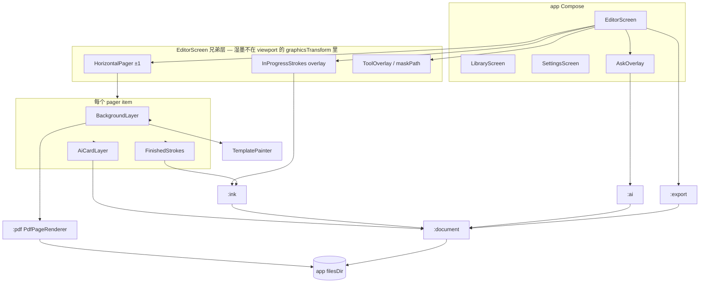
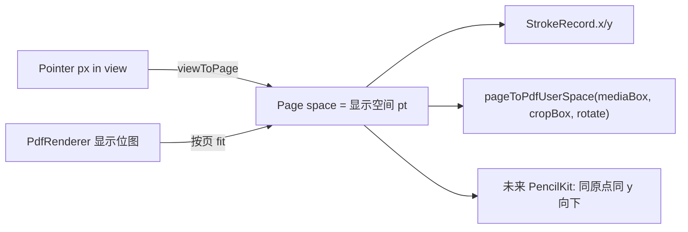
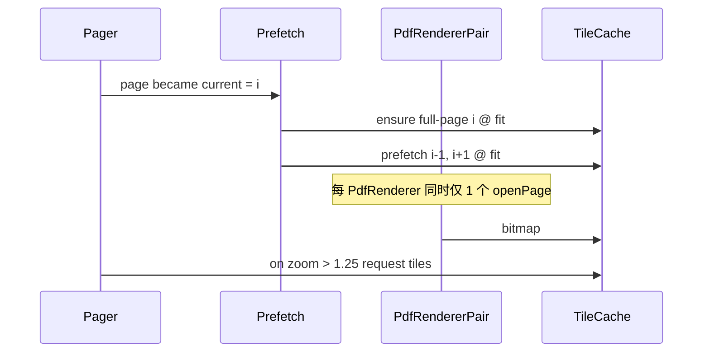
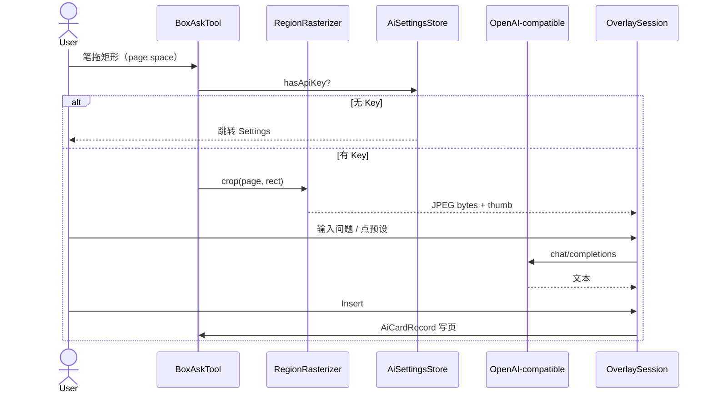
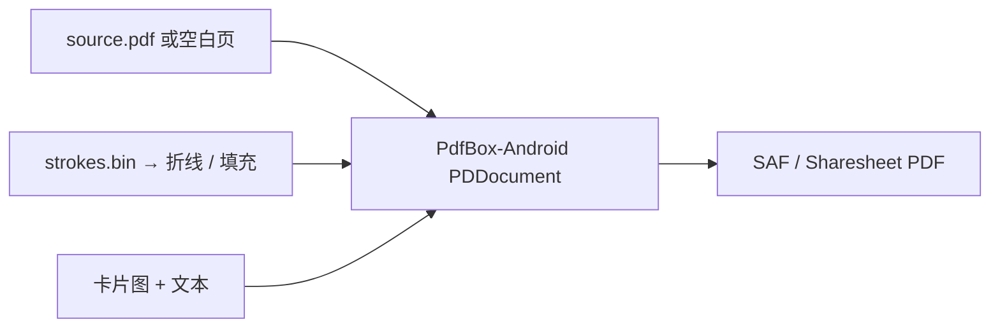
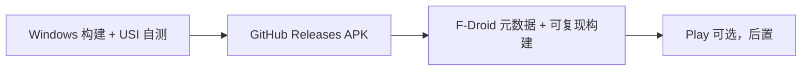

# oh-my-ainote 技术设计文档

| 字段 | 值 |
| --- | --- |
| 文档标题 | oh-my-ainote v1 技术设计 |
| 作者 | Moon-Force / 待署名 |
| 日期 | 2026-08-16 |
| 状态 | Baseline implemented（r9；实现差异见 `IMPLEMENTATION.md`，另待发布门禁验收） |
| 仓库 | https://github.com/Moon-Force/oh-my-ainote |
| 本地路径 | `D:\开源项目\ainote`（实现分支 `codex/implement-design`） |
| 应用 ID | `com.moonforce.ohmyainote` |
| 许可 | MIT（见 §14） |

| 修订 | 日期 | 说明 |
| --- | --- | --- |
| r4 | 2026-08-16 | 用户拍板原 Open Questions。工程栈锁定 **Kotlin + Compose + AndroidX Ink 1.0**。评审收敛至 0 open issues。 |
| r5 | 2026-08-16 | 用户试过 **Dart / Flutter**（自研墨水面 + pdfrx）。产品锁未改。 |
| **r6** | **2026-08-16** | **用户改回 Kotlin + AndroidX Ink。** 产品锁与 r4 一致。Flutter / 自研 Dart 墨水 / pdfrx 再次成为已拒绝方案（见 §18.1）。 |
| **r7** | **2026-08-18** | **按 r6 落地七模块实现。** JVM 测试、debug APK、release/R8 和依赖红线已验证；真机门禁保留在 `MANUAL_TEST.md`。 |
| **r8** | **2026-08-19** | **按用户要求升级 AndroidX Ink 1.1.0-alpha07。** 当前钢笔基于官方 `pressurePen` 追加版本化宽度/浓淡压感；旧笔迹保持原样。 |
| **r9** | **2026-08-19** | **补齐 Material 3 编辑器工具区与显示稳定性修复。** 颜色/粗细直接进入 Ink Brush；固定工具视口，并取消 UI 位图的手动 recycle。 |

---

## 1. Overview

**oh-my-ainote** 是一款 **Android 平板优先、本地优先、无账号** 的课堂 / 会议手写笔记本。产品形态对标 GoodNotes / Notability 的「一本笔记本 + 分页纸张 + 手写即正文」，第一胜负手是：**笔感足够好，且能把笔记带出去（导出扁平 PDF）**。

v1 不在纸上做 OCR / 全文搜索 / 对话式笔记助手。AI 只有一条路径：**框选页上区域 → 栅格化为图 → 连同用户问题发给 OpenAI 兼容多模态模型 → 默认浮层对话；用户可选择把一张 AI 卡片钉回纸面**。应用完全离线可写、可翻、可导出；API Key 为空时写字与 PDF 仍可用，仅框选提问会引导去设置。**iPad 不在 v1 代码范围内。** 计划中的第二客户端是 **同一文档格式 + PencilKit**，**不是** Flutter iOS 应用。v1 不写 Swift，也不把 Mac 当门禁。

本文最初用于空仓落地；截至 r7，模块树、文档格式、墨水 / PDF / AI / 导出路径已经在 `codex/implement-design` 分支实现。本文继续保存完整决策、约束、验收指标与风险；精简的当前状态以 `IMPLEMENTATION.md` 为准。

---

## 2. Background & Motivation

### 2.1 为什么现在做

课堂与会议的「一张 PDF 讲义 + 手写批注 + 偶尔问模型这块写的是什么」是高频、可交付的闭环。现有选择要么是闭源（GoodNotes / Notability / 三星笔记），要么在 Android 平板上缺「PDF 当纸 + 低延迟墨水」：

| 项目 | 与本产品关系 | 为何不 fork 成应用 |
| --- | --- | --- |
| **Saber** | Flutter + `perfect_freehand`，最接近的跨平台手写 OSS | **先验艺术，只学习不 fork。** 产品不同：无限画布 / 多层文件夹 / Nextcloud 同步 / GPL-3.0；**PDF-as-paper 是已知缺口**；无本产品的框选 AI、互斥纸张 kind、单层 `library.json`、BYOK 任意 URL、便携 `.ainote`。fork 会把许可与产品一并绑死。 |
| Xournal++ / Rnote | 桌面 PDF+ink 黄金标准 | 移动端口停更 / 归档 |
| perfect-freehand / ink-stroke-modeler | 点列美化 / 预测 | 不是平板应用。r5 曾拟用其 Dart 移植做干笔轮廓；**r6 不用**（湿干都走 AndroidX Ink） |
| **AndroidX Ink 1.1.0-alpha07** | 官方 Android 低延迟墨水；1.1 提供程序化自定义笔刷 API | **采用并钉死 alpha07。** 当前钢笔在官方 `pressurePen` 上追加版本化宽度/浓淡压感。含 `ink-authoring-compose`，编辑器级唯一 `InProgressStrokes`。 |
| Flutter 自研墨水 + pdfrx | r5 用户试过的跨端方案 | **r6 拒绝。** 延迟打不到官方 Ink 路径；第二客户端改回「格式 + PencilKit」，不再是同一 Flutter 应用。见 §18.1。 |

不存在可直接 fork 的成熟 FOSS「Android 平板课堂本 + 框选 AI + 便携包」。正确路径是：**自研 `.ainote` + AndroidX Ink 把 PDF 当纸**；iPad 以后用 **同一格式 + PencilKit**。

### 2.2 当前状态与痛点

- 本地仓库 `D:\开源项目\ainote`：`origin = https://github.com/Moon-Force/oh-my-ainote.git`；实现位于 `codex/implement-design`，等待审阅与提交。
- 作者环境：**Windows 11**，无 iOS 构建机。验收必须在 **USI Android 平板** 上做，模拟器不能代表墨水延迟。
- 开发机：**Windows 11 + Android Studio + JDK 17 + USB 真机平板。** v1 不要求 Mac。日常 JVM 单测（`:document` / `:ai-api`）在 Windows 上红绿；墨水 / `PdfRenderer` / Keystore 必须 USI 真机。
- 兄弟产品 [oh-ai-email](https://github.com/Moon-Force/oh-ai-email) 仅作 **产品语气** 参考（本地优先、BYOK、无托管后端、MIT）。**禁止抄它的 Electron / Rust 架构。**

### 2.3 已锁定产品决策（grilling，本文不再重开）

1. Job：课堂 / 会议手写本。Notebook + paged paper。手写是正文。单用户学习 / 工作。第一胜负手：写着爽 + 能导出。
2. 平台：**Android 平板先发**（作者在 Windows 11，无 Mac）。**iPad 不是 v1 代码。** 以后的第二客户端 = **同一文档格式 + PencilKit**，**不是** Flutter iOS 应用。v1 不写 Swift、不上云 Mac。
3. 本地优先、无账号。笔记本是本机文档。离线可写 / 翻 / 导出。无登录。
4. AI v1 **不是** OCR / 搜索 / chat-first，而是框选 → 图 + 问题 → 多模态直问。
5. 回答默认浮层（不脏纸）。可 **Insert** 一张 AI 卡片（缩略图 + 问 + 答，绑定该选区）。未插入的浮层对话丢弃、不导出。
6. 纸张：必须能在 **PDF 页** 与 **图片** 背景上写；**不解析 PPTX**（用户自行转 PDF）。也可建 blank / lined / grid。一本笔记只有一种：模板 **或** PDF 导入 **或** 图片导入。v1 **禁止** 同一本里混 PDF 页与空白页。
7. 栈（**r8 当前锁定**）：**Kotlin 2.1.x + Jetpack Compose + AndroidX Ink 1.1.0-alpha07**（含 `ink-authoring-compose`）。PDF 显示 = 系统 `PdfRenderer` 双实例。笔画坐标在 **page space**（= PdfRenderer 显示空间）。**禁止** Flutter 自研墨水、禁止把 pdfrx 当选定显示引擎、禁止再维护 Ink PlatformView / View 分叉。
8. OSS 格局见上表；用 AndroidX Ink，不 fork 桌面应用。
9. AI 传输：**BYOK**，设置里填 OpenAI 兼容 `baseUrl` + `apiKey`。空 Key 时写 / PDF 仍可用。仓库无密钥。v1 不捆绑付费云。端侧 VLM 是未来可选项，不是 v1 唯一路径。
10. 验收设备：**USI Android 平板**（小米 / 联想 / Pixel 级）。S Pen 更好但不是必测机。Boox 不是 v1 门槛。模拟器不能验收墨水延迟。
11. v1 工具：钢笔 + 荧光笔 + **整笔橡皮（object eraser）** + 撤销 / 重做 + 框选提问。手指只负责平移 / 缩放 / 翻页。笔才写。无像素橡皮、无套索移动、无录音、无形状识别。
12. 导出：扁平 PDF（背景 + 墨水 + 已插入 AI 卡片）。浮层对话不导出。可再编辑交换包是 v1 `.ainote` ZIP。

---

## 3. Goals & Non-Goals

### 3.1 Goals（v1 必须交付）

- 在 USI 平板上用笔在模板纸 / PDF / 图片上书写，主观延迟达到 §9 指标。
- 创建三种互斥种类的笔记本，单层文件夹归档（无标签），浏览、翻页、撤销 / 重做、整笔擦除。
- 本机目录文档，杀进程后能打开同一本，笔画还在。
- 框选提问（浮层）；可插入 AI 卡片；无 Key 时引导设置且不阻断书写。
- 导出扁平 PDF，可用系统阅读器打开。
- GitHub Releases 提供可安装 APK；工程可在 Windows 上构建。

### 3.2 Non-Goals（v1 明确不做）

| 不做 | 说明 |
| --- | --- |
| iPad / 桌面作为 v1 交付 | v1 只发 Android APK。第二客户端以后是 **格式 + PencilKit**，不是 Flutter iOS |
| Flutter 双端 / Flutter 自研墨水 / pdfrx 显示引擎 | **r6 非目标。** r5 试过，因延迟与官方墨水路径改回。见 §18.1 |
| 账号、同步、云盘后端 | 无服务器 |
| OCR、全文搜索、笔记 Chat | AI 只有框选直问 |
| PPTX 解析、PDF 与空白混页 | 用户自行转 PDF |
| 像素橡皮、套索移动、形状识别、录音 | 锁 11 |
| 端侧 VLM 作为 v1 必经 | 可在设置预留「以后」 |
| 云同步、增量合并或多人编辑 `.ainote` | v2；v1 只做整包导入/导出 |
| 夜间 PDF 反色 | 见 §7.5，v1 范围外 |
| 加密笔记本、多用户、文件夹云同步 | 超出 Job |
| Play 上架作为 v1 门禁 | 可后置；先 GitHub / 再 F-Droid |

---

## 4. Proposed Design

### 4.1 逻辑分层

```
┌─────────────────────────────────────────────────────────────┐
│  :app  Compose UI + ViewModel（v1 不另建 :feature-* 模块）    │
│  ui/library · ui/editor · ui/settings · Overlay · Export    │
│  ViewModel 不碰 MotionEvent；手势只在 :ink / 编辑器层处理      │
├───────────────┬───────────────┬───────────────┬─────────────┤
│  :ink         │  :pdf         │  :ai          │  :export    │
│  AndroidX Ink │  PdfRenderer  │  Keystore     │  PdfBox     │
│  作者/渲染/命中│  瓦片栅格     │  裁切 / 会话  │  压平写回   │
├───────────────┴───────┬───────┴───────────────┴─────────────┤
│  :ai-api  JVM         │  :document  JVM                      │
│  PromptBuilder / HTTP │  清单、页、便携笔画、卡片、I/O、Undo  │
└───────────────────────┴─────────────────────────────────────┘
```

v1 **不**建 `:feature-editor` 一类模块。用例 ViewModel 放在 `:app` 的 `ui/library`、`ui/editor`、`ui/settings`。仅当 `:app` 大到无法单 PR 审查时再拆 feature 模块。

`:document` 与 `:ai-api` **不得**依赖 Android SDK，以便在 **Windows JVM** 上单测格式、撤销与 AI 请求形状。`:ink` / `:pdf` / `:export` / `:ai` 依赖 Android。`:ai` 只放 Keystore、`RegionRasterizer`、`OverlaySession`、DataStore 桥；HTTP 模型与 `PromptBuilder` 在 `:ai-api`。

### 4.2 建议仓库树（从空仓库脚手架）

```
oh-my-ainote/
├── LICENSE                          # MIT
├── README.md
├── SECURITY.md                      # 禁止提交密钥；泄露处理
├── AGENTS.md                        # 代理约束（对齐兄弟仓语气，内容针对本应用）
├── settings.gradle.kts
├── build.gradle.kts
├── gradle/
│   ├── libs.versions.toml
│   └── wrapper/
├── .github/workflows/
│   ├── ci.yml                       # JVM test + assembleDebug
│   └── release.yml                  # tag → signed APK（密钥在 Actions secrets）
├── fastlane/metadata/android/       # 为 F-Droid 预留，v1 可先放 en-US / zh-CN 短描述
├── docs/
│   ├── PRODUCT.md
│   ├── ARCHITECTURE.md              # 本文落地后的精简版
│   ├── FORMAT.md                    # 文档格式权威说明（与 :document 同步）
│   └── IMPLEMENTATION.md            # 与 PR Plan 对应的验收清单
├── app/                             # applicationId com.moonforce.ohmyainote
│   └── src/main/
│       ├── AndroidManifest.xml
│       └── java/com/moonforce/ohmyainote/
│           ├── OhMyAinoteApp.kt      # PDFBoxResourceLoader.init + AppContainer
│           ├── MainActivity.kt
│           ├── di/AppContainer.kt
│           ├── ui/AppNav.kt
│           ├── ui/library/           # 书架 ViewModel + UI
│           ├── ui/editor/            # 编辑器 ViewModel + UI（含单一湿墨 overlay）
│           └── ui/settings/          # BYOK 设置
├── document/                        # :document  JVM library
│   └── src/
│       ├── main/kotlin/com/moonforce/ohmyainote/document/
│       │   ├── model/               # NotebookManifest, PageModel, StrokeRecord, AiCard
│       │   ├── format/              # OmaFormatV1, ManifestCodec, StrokeCodec
│       │   ├── store/               # NotebookStore (文件系统契约)
│       │   └── undo/                # Command, UndoStack
│       └── test/kotlin/...          # Windows 可跑
├── ink/                             # :ink  Android library
│   └── src/main/java/com/moonforce/ohmyainote/ink/
│       ├── AuthoringSurface.kt      # InProgressStrokes + 变换
│       ├── FinishedStrokeRenderer.kt
│       ├── BrushCatalog.kt          # StockBrushes 映射
│       ├── HitTest.kt               # 整笔橡皮 AABB + shape.intersects
│       ├── InputFilter.kt           # 笔 vs 手指
│       └── StrokeBridge.kt          # StrokeRecord ↔ androidx.ink.strokes.Stroke
├── pdf/                             # :pdf  Android library
│   └── src/main/java/com/moonforce/ohmyainote/pdf/
│       ├── PdfPageRenderer.kt       # PdfRenderer 封装
│       ├── TileCache.kt
│       ├── PrefetchController.kt
│       └── PageBitmapRequest.kt
├── ai-api/                          # :ai-api  纯 JVM library
│   └── src/
│       ├── main/kotlin/.../ai/api/
│       │   ├── OpenAiCompatibleClient.kt
│       │   ├── PromptBuilder.kt
│       │   └── ChatCompletionsModels.kt
│       └── test/kotlin/...          # MockWebServer，不读真实 Key
├── ai/                              # :ai  Android library
│   └── src/main/java/.../ai/
│       ├── RegionRasterizer.kt      # Bitmap 裁切，仅 Android
│       ├── AiSettingsStore.kt       # Keystore + DataStore
│       └── OverlaySession.kt
├── export/                          # :export  Android library
│   └── src/main/java/.../export/
│       ├── FlattenedPdfExporter.kt  # PdfBox-Android
│       └── ExportProgress.kt
└── gradle.properties
```

Gradle 模块名：`:app`、`:document`、`:ink`、`:pdf`、`:ai-api`、`:ai`、`:export`。`:app` 依赖其余全部；`:ink` / `:pdf` / `:export` / `:ai` 依赖 `:document`；`:ai` 依赖 `:ai-api`；`:ai-api` 只依赖 OkHttp + serialization。模块之间禁止环依赖。

`namespace` 一律 `com.moonforce.ohmyainote.<module>`。

### 4.3 技术栈钉扎

| 项 | 选择 | 理由 |
| --- | --- | --- |
| 语言 | **Kotlin 2.1.x** | 钉具体补丁版，写入 `libs.versions.toml` |
| AGP / Compose BOM | AGP **8.10+**、Compose BOM **现行稳定**（脚手架日钉死） | 禁止浮动 `+` |
| UI | Jetpack Compose + Material 3 | 锁定 |
| 墨水 | `androidx.ink:ink-*:1.1.0-alpha07`（**精确钉死**） | 用户要求最新 Ink；只采用程序化自定义笔刷能力，不引入像素橡皮等额外实验功能 |
| 墨水 Compose | `ink-authoring-compose` / `ink-brush-compose` / `ink-geometry-compose` **1.1.0-alpha07** | 唯一湿墨路径：`InProgressStrokes`。**禁止**再维护一套 `InProgressStrokesView` + `AndroidView` 架构；Views API 仅作为 AGENTS.md 一行逃生舱（Compose artifact 从 Maven 消失时才考虑） |
| 低延迟依赖 | Ink 传递依赖的 `androidx.graphics:graphics-core` | Front buffer / 预测；版本由已钉死的 Ink 依赖图决定 |
| PDF 显示 | `android.graphics.pdf.PdfRenderer` | 无额外 native、Apache 友好、支持 clip+matrix 瓦片 |
| PDF 写出 | `com.tom-roush:pdfbox-android:2.0.27.0`（**冻结此版本，禁止默升**） | Apache-2.0。必须 `PDFBoxResourceLoader.init(context)`（见 §8.4）。**禁止 iText**（AGPL） |
| 网络 | OkHttp 4.12+ | 单一 `POST {baseUrl}/chat/completions` |
| JSON | kotlinx.serialization | 清单 / 设置 / AI 请求 |
| 设置 | DataStore Preferences + Android Keystore AES-GCM | `EncryptedSharedPreferences` 已废弃（security-crypto 1.1） |
| 异步 | coroutines + `ViewModel` | 标准 |
| DI | 手写 `AppContainer`（v1 不上 Hilt） | 减少 KSP 摩擦，F-Droid 更简单 |
| minSdk | **29**（Android 10） | 见 §11 |
| compileSdk / targetSdk | **36** | 2026-08 的现行目标 |
| JDK | 17 | AGP 现行默认 |

湿墨 **只**走 Compose `InProgressStrokes` @ `1.1.0-alpha07`。不要为「万一没有 compose 工件」分叉第二套 ink 架构。

### 4.4 运行时架构



湿墨是 `EditorScreen` 上与 `HorizontalPager` **平级** 的 overlay。Pager / `ZoomPanViewport` 的 `graphicsLayer` **不得**再套一层到 `InProgressStrokes` 上——相机只通过 `pointerEventToWorldTransform`（= `invert(pageToView)`）进入湿墨。图与 §4.5.1 / §4.8 不一致时以文字为准。

### 4.5 墨水路径

#### 4.5.1 图层与职责

编辑器一页是固定宽高的 **page surface**（尺寸 = 该页 `widthPt × heightPt`）。Pager 项里 **只**放背景 / 干墨 / 卡片，**不**放湿墨。

自下而上（整页编辑器，不是每个 pager item）：

1. **HorizontalPager 项内**
   - **BackgroundLayer** — 模板矢量 / PDF 瓦片 / 图片。不接收笔事件。
   - **FinishedStrokesLayer** — `CanvasStrokeRenderer.draw(canvas, stroke, pageToView)`。
   - **AiCardLayer** — 已插入卡片（缩略图 + 短问短答）。v1 不可移动；点卡片只展开只读。
2. **编辑器级唯一 `InProgressStrokes`**（`androidx.ink.authoring.compose`）— 盖在 pager **之上** 的全屏 overlay。官方 1.0 Compose 源码约定：**屏幕上只能有一个实例**；禁止随 pager 增删 / 随页 resize。湿墨、低延迟、预测点都走这里。
3. **ToolOverlay** — 框选矩形、翻页按钮、非模态 Overlay chat。湿墨不得画到 chrome 上：把工具条 / sheet 的视口矩形写成 `InProgressStrokes.maskPath`（官方 API 正是为此；干墨提交后在 overlay 之下，不会闪）。Ask sheet 打开时也可直接 `defaultBrush = null`（官方：保留 GPU 资源但不绘制）。

工具 ≠ Pen / Highlighter 时：`defaultBrush = null`（橡皮 / 框选 / 平移），避免湿墨抢指针。

官方要求：若支持缩放 / 平移，必须把 **pageToView 的逆** 传给 `pointerEventToWorldTransform`，湿墨才与干墨对齐（见 [State preservation](https://developer.android.com/develop/ui/compose/touch-input/stylus-input/ink-api-state-preservation)）。注意：Compose `InProgressStrokes.pointerEventToWorldTransform` 的类型是 **`androidx.compose.ui.graphics.Matrix`**，不是 `android.graphics.Matrix`。Google 自己那份 state-preservation 示例用了错误类型（issuetracker 481165331）；实现以 Compose 函数签名为准。

```kotlin
// ink/AuthoringSurface.kt — 关键接口（实现落在 PR-04a；磁盘在 PR-04b）
@Composable
fun AuthoringSurface(
    page: PageModel,
    viewport: ViewportState,          // scale, panPx, pageOriginInView, density
    tool: Tool,
    brush: Brush?,                    // 非书写工具为 null
    finished: List<Stroke>,
    maskPath: Path?,                  // 工具条 / sheet 挖洞
    onStrokesFinished: (List<Stroke>) -> Unit,
    onEraseAt: (pageX: Float, pageY: Float) -> Unit,
    onBoxCommitted: (PageRect) -> Unit,
)
```

**变换合约（删除任何手写「先 pan 再 1/scale 再除一次 origin」的示例公式）：**

1. 用与干墨 `Canvas` **完全相同**的步骤构造 `pageToView`（page-pt → 视图像素）：先把 page 原点放到视口中的 `pageOriginInView`，再乘 `scale`，再加上 `panPx`，其中 `1 page-pt = (densityDpi / 72) px`（**不要**把 `scale` 再乘进 pt→px）。
2. `viewToPage = invert(pageToView)`。求逆失败视为 bug。
3. 把 `viewToPage` 转成 `androidx.compose.ui.graphics.Matrix` 交给湿墨。
4. **禁止**维护两套独立公式。

`:document` 提供纯数字 `Affine2`。单测矩阵（PR-04a / JVM）：identity；仅 pan；仅 zoom；zoom+pan；`density = 2` 与 `3.5`；`pageOriginInView ≠ (0,0)`。往返误差 ≤ 1e-3 pt。PR-04a 合入阻断：USI 格子纸校准（§16.3）湿干对齐。

`strokeToWorldTransform` 保持 **单位阵**：笔画出生即在 page space。

#### 4.5.2 World unit 与 epsilon

官方建议常见 app 用 1 world unit = 1 dp，并在 10× 缩放时取 `epsilon ≈ 0.025` dp（[Epsilon and coordinate system](https://developer.android.com/develop/ui/compose/touch-input/stylus-input/ink-api-coordinate-system)）。本产品 **必须** 与 PDF / 未来 iPad 共享坐标，因此：

| 量 | v1 取值 | 说明 |
| --- | --- | --- |
| World / page unit | **1 PDF point = 1/72 inch** | 与 `PdfRenderer.Page.width/height` 同单位 |
| 原点 | **显示页**左上角 | x 右、y 下；PDF 页则是旋转+Crop 之后的显示原点，见 §4.6 |
| `Brush.epsilon` | **0.01 page-pt** | 约 3.5 µm；10× + ~320 dpi 时量化仍 ≤ 1 px 量级 |
| 默认钢笔 `Brush.size` | **2.5 pt** | 约 0.88 mm |
| 默认荧光笔 `Brush.size` | **14 pt** | 半透明宽笔 |
| 缩放范围 | 0.25× – 8×，双击回 1× fit-width | 超过 ~10× 官方警告几何伪影；8× 留余量 |

`strokeUnitLengthCm`（`MutableStrokeInputBatch.add` 可选参数）在已知物理尺寸时传入 `pt * 2.54 / 72`，让压感笔刷按真实厘米缩放。模板 / PDF 页都有明确 pt 尺寸，应当传入。

#### 4.5.3 笔刷目录

只用 `StockBrushes`，不引入自定义 `BrushFamily` protobuf（降低跨平台负担）：

| 工具 | `BrushFamily` | 颜色 | 备注 |
| --- | --- | --- | --- |
| Pen | `StockBrushes.pressurePen()` + `OMA_PRESSURE_INK_V1` 两条官方自定义 behavior | 用户选，默认 `#1A1A1A` | 保留官方预测/收笔/速度/方向/高压变宽；追加低压变细与压力不透明度；缺压力时倍率 1.0 |
| Highlighter | `StockBrushes.highlighter()` | 默认 `#66FFEB3B`（预乘 / colorLong 按 Ink API） | `SelfOverlap` 用库默认 |
| Eraser | 非笔刷 | — | 见命中 |
| Box-ask | 非笔刷 | — | 画矩形 |

序列化存版本化枚举 `stockBrush: PRESSURE_PEN | OMA_PRESSURE_INK_V1 | HIGHLIGHTER` + `size` + `colorLong` + `epsilon`。`PRESSURE_PEN` 仅用于兼容旧笔迹；新钢笔写入 `OMA_PRESSURE_INK_V1`。曲线定义以 `FORMAT.md` 为准，调整曲线必须新增 ID。

#### 4.5.4 预测笔画、掌拒、压感、悬停

| 能力 | v1 策略 |
| --- | --- |
| 预测点 | 交给 `InProgressStrokes` / `InProgressStrokesView`（内部走 Motion Prediction + graphics-core）。应用不自写预测器。 |
| 掌拒 | **硬规则**：`PointerType.Stylus`（及 `Eraser` 笔尾，见下）才能画；`PointerType.Touch` / `Mouse` 只驱动 viewport。不依赖 OEM 掌拒黑盒。 |
| 压感 | `MotionEvent.getPressure()` → Ink `StrokeInput.pressure`。当前钢笔以压力同时驱动线宽和不透明度，输入先做 30 ms 阻尼；无压力字段时使用中性倍率 1.0。 |
| 倾斜 / 方位 | 有则写入（`AXIS_TILT`、orientation）；无则缺省。便携格式用 flag 位表示缺省。 |
| 悬停 | USI 若提供 `ACTION_HOVER_MOVE`，**尽力**画淡十字 / 笔尖预览。**不是验收项。** |
| 笔尾 | `PointerType.Eraser` 在任何工具下都走整笔橡皮（便利，不增加产品范围）。 |
| 手指 | 单指平移、双指缩放。翻页：**按钮** + **仅手指** 的边缘区 fling。见 §4.8。 |
| 书写中冻结相机 | 自 stylus `DOWN` 至 `onStrokesFinished` / cancel，**冻结** viewport（忽略 pinch / pan）。中途改相机是湿干错位与笔画被 cancel 的已知源。 |

输入分流必须在到达 `InProgressStrokes` **之前** 完成，避免手指留下墨点。stylus 存活期间 `HorizontalPager.userScrollEnabled = false`，否则 Pager 会消费后续 MOVE，官方行为是 **取消** 该湿笔。

#### 4.5.5 延迟指标（验收）

Google 在 Tab S8 上的 Ink 演示约 **4 ms** 端到端（三星预测 + front buffer）。USI 机（小米 / 联想 / Pixel 类）通常明显慢于三星链路。

| 指标 | 目标 | 如何测 |
| --- | --- | --- |
| 主观「跟上笔」 | 验收机上无「笔在墨前一截」的明显脱节 | 真人书写 30 s |
| 运动到像素 p95 | **< 20 ms**（v1 门槛） | debug overlay：`down/move` 时间戳 vs 下一帧 `Choreographer` |
| 硬失败 | **> 33 ms** 稳定可见延迟 | 不发布 |
| 干墨提交 | `onStrokesFinished` 后下一帧可见，无闪断 | 湿→干交接 |
| 翻页（已预取） | **< 100 ms** 到可写 | 见 PDF 预取 |
| 说明 | 模拟器 **不能** 验收本表 | 只用于功能冒烟 |

20 ms 约为 60 Hz 的 1.2 帧、120 Hz 的 2.4 帧。选 20 ms 而不是 4 ms：4 ms 是旗舰三星演示，不是 USI 保底。

#### 4.5.6 工具与命中

整笔橡皮（官方 Geometry 示例的直接用法，[Geometry APIs](https://developer.android.com/develop/ui/compose/touch-input/stylus-input/ink-api-geometry-apis)）：

```kotlin
fun eraseIntersectingStrokes(
    prev: MutableVec,
    current: MutableVec,
    strokes: MutableList<Stroke>,
    eraserPaddingPt: Float = 4f,
) {
    val parallelogram = MutableParallelogram().populateFromSegmentAndPadding(
        MutableSegment(prev, current),
        eraserPaddingPt,
    )
    strokes.removeAll { it.shape.intersects(parallelogram, AffineTransform.IDENTITY) }
}
```

坐标必须已是 **page space**。先用每笔 AABB 粗筛（`populateMeshBounds` / `page.json` 的 `aabb`），再 `shape.intersects`。`aabb` **只**给橡皮粗筛，不给 AI。

框选（Box-ask）：**永不命中笔画**。笔只记录轴对齐 `PageRect`（最小 24 pt），然后对该矩形做栅格（§8.1）。不是套索、不改 `strokes.bin`。

撤销 / 重做：`:document` 的 `UndoStack`（命令栈本身 **不落盘**）。命令：`AddStrokes`、`RemoveStrokes`（橡皮）、`InsertCard`、`DeleteCard`。容量 **80**。

**耐久不变量（§4.7.7）：** 每一次 `UndoStack.apply`（含 redo）与抬笔一样 enqueue **同一套** 页目录原子写。防抖可以合并连续写，但 **不得丢掉末尾一次 undo/erase**。杀进程后失去的是「再撤一步」的能力，**不是**纸面内容。禁止出现「擦掉/撤掉的墨水死后复活」。

### 4.6 坐标系（跨 PDF / 缩放 / iPad）



**Page space = `PdfRenderer` 画出来的那张「显示页」**，不是未旋转的 PDF 用户空间。课堂 PPT 导出的 PDF 大量是 `MediaBox = 612×792` + `/Rotate 90`。v1 **必须导入**这类文件，不得拒收。

**Page space 合约（写入 `docs/FORMAT.md`，视为格式的一部分）：**

- 单位：PDF point（1/72 inch）。
- 原点：显示页的 **左上角**（旋转 + Crop 之后）。
- 轴：x 向右增加，y **向下**增加。
- 页尺寸 `widthPt` × `heightPt`：
  - 模板：A4 = `595.27563 × 841.88976`；可选 Letter `612 × 792`、A5 `419.52756 × 595.27563`。默认 **A4 竖向**。
  - PDF：等于 `PdfRenderer.Page.width/height`（已是 **旋转后** 的显示尺寸，pt）。并在 `page.json` 持久化 `mediaBox`、`cropBox`、`rotate ∈ {0,90,180,270}`，供导出与未来 PencilKit 重建同一映射。
  - 图片：导入时用 `ExifInterface` **把方向烘焙进** 写入 `media/images/` 的 JPEG/PNG，使文件像素与显示一致；再按烘焙后像素比，**长边 = 792 pt**。不另存 `orientation` 字段（避免渲染 / 导出 / AI 裁切漏乘）。
- **不要**再用 `x_pdf = x; y_pdf = heightPt - y` 作为通用导出公式。那只是 `rotate = 0` 且 CropBox 原点与显示原点重合时的退化。

`pageToPdfUserSpace`（`:document` 纯函数，导出与 FORMAT 共用）。令 CropBox 为 `(clx, cly, clw, clh)`（无 CropBox 则用 MediaBox）。显示尺寸：`rotate ∈ {0,180}` 时 `W=clw, H=clh`；`rotate ∈ {90,270}` 时 `W=clh, H=clw`。page `(x,y)` 左上 y 下 → 未旋转 PDF 用户空间（左下 y 上）。

`/Rotate` 是阅读器顺时针转纸。180° 后，显示左上角是原 Crop **右下** `(clx+W, cly)`，不是右上。**禁止**在 180 行再套一层 `H - y`（那是 rotate=0 的 y 翻转，叠上去会把 (0,0) 送到原右上）。

| `/Rotate` | `x_user` | `y_user` |
| --- | --- | --- |
| 0 | `clx + x` | `cly + H - y` |
| 90 | `clx + y` | `cly + x` |
| 180 | `clx + W - x` | **`cly + y`** |
| 270 | `clx + H - y` | `cly + W - x` |

规范以 **四角点** 为准（JVM 夹具必须断言这 16 个点，禁止只测 (0,0) 或对照旧 180 行）。`W,H` 为显示尺寸；90/270 时 `W=clh`、`H=clw`。

| rotate | page(0,0) | page(W,0) | page(0,H) | page(W,H) |
| --- | --- | --- | --- | --- |
| 0 | `(clx, cly+H)` | `(clx+W, cly+H)` | `(clx, cly)` | `(clx+W, cly)` |
| 90 | `(clx, cly)` | `(clx, cly+clh)` | `(clx+clw, cly)` | `(clx+clw, cly+clh)` |
| 180 | `(clx+W, cly)` | `(clx, cly)` | `(clx+W, cly+H)` | `(clx, cly+H)` |
| 270 | `(clx+clw, cly+clh)` | `(clx+clw, cly)` | `(clx, cly+clh)` | `(clx, cly)` |

实现用 `when (rotate)` 对照上表。自检推导（不要当第二套公式源）：先把 page 左上坐标改成显示左下 `(x, H-y)`，再绕 Crop 左下做 **`−rotate`**，最后加 `(clx, cly)`；结果必须与角点表逐点相同。

`:export` 在 **未旋转用户空间** 里用该仿射画墨水 / 卡片，**保留** 原页 `/Rotate`，阅读器再转一次，屏幕与扁平 PDF 对齐。其它 box（仅有 Bleed/Trim、非 90° 倍数 rotate、负 Crop）导入失败并提示，不静默空白页。

- iPad：UIKit / PencilKit 也是左上、y 下。摄入时 **不要再翻转 y**；按 `widthPt/heightPt` 铺纸。PDF 背景用同一 `mediaBox/cropBox/rotate`。

缩放 / 书写：变换只存在于 viewport 相机，**不写入**笔画。湿笔期间相机冻结（§4.5.4）。这是跨设备的前提。

### 4.7 文档格式（平台无关）

#### 4.7.1 设计原则

- **工作副本 = 目录**（崩溃安全、可部分写）。
- **交换 / 备份 = ZIP**，扩展名 **`.ainote`**（标准 ZIP，无密码）。
- 权威版本字段：`formatVersion: 1`。读到 `> 实现所支持的最大版本` 则拒绝并提示升级应用；读到未来次字段忽略。
- 笔画的 **权威表示是便携点列**，不是 AndroidX protobuf。Android 启动时由点列重建 `androidx.ink.strokes.Stroke`。可选缓存 `inputs.inkbin`（`StrokeInputBatch.encode`）可删可重建。
- 一本笔记一种 `kind`：`template` | `pdf` | `image`。页的 `background` 必须全部属于该 kind。

#### 4.7.2 磁盘布局

应用私有目录：

```
{filesDir}/library.json           # 书架文件夹索引（非笔记本格式；不进 .ainote）
{filesDir}/notebooks/{notebookId}/
  manifest.json
  media/
    source.pdf              # kind=pdf
    images/                 # kind=image
      0001.jpg
    cards/{cardId}.jpg      # 插入卡片时保存的选区图
  pages/
    0001/
      page.json
      strokes.bin           # OmaInputsV1
    0002/
      ...
  tmp/                      # 原子写中转，启动时清空
```

`notebookId`：UUIDv4，目录名即 ID。

应用内分享 / 导入：`importAinote` **永远**分配新的 UUIDv4 目录。ZIP 内 `manifest.id` 只作 provenance（可另存 `importedFromId`），或在写入时改写成新 ID。**禁止**按原 ID 合并 / 覆盖已有笔记本目录。导出分享：把该目录打成 ZIP，文件名 `{title}.ainote`，经应用内 Sharesheet / SAF 送出。v1 **不**注册 MIME、**不**声明 `VIEW` / `SEND` intent-filter，系统文件管理器点 `.ainote` **不会**打开本应用；导入只走应用内 SAF 选择器。

v1 **不**在 Documents 树放工作副本。导出 PDF / `.ainote` 才走 SAF / Sharesheet。

#### 4.7.2.1 书架文件夹（`library.json`）

用户拍板：v1 **有文件夹、无标签**。文件夹是本机书架索引，**不是**第二种文档格式，**不**写入 `manifest.json`，**不**打进 `.ainote`（导入后落在「未归档」）。

规则：

- 一本笔记属于 **至多一个** 文件夹，或「未归档」。
- **单层**：文件夹不能嵌套。
- 删文件夹：只解绑，不删笔记本。
- 权威文件：`{filesDir}/library.json`（与笔记本目录并列）。原子写同样走 `.bak` 两步 rename。

```json
{
  "formatVersion": 1,
  "folders": [
    { "id": "7c1e…", "name": "线性代数", "order": 0 }
  ],
  "membership": [
    { "notebookId": "2f0c6a5e-…", "folderId": "7c1e…" }
  ]
}
```

未出现在 `membership` 中的笔记本视为未归档。`folderId` 指向不存在的文件夹时视为未归档（打开时清洗）。文件夹名可空格，禁止空名；`order` 为书架侧栏排序。

#### 4.7.3 `manifest.json`

```json
{
  "formatVersion": 1,
  "minReaderVersion": 1,
  "id": "2f0c6a5e-9c3a-4d0b-9c2e-1b7d8a0e4c11",
  "title": "线性代数 第3讲",
  "kind": "pdf",
  "createdAt": "2026-08-16T10:00:00Z",
  "updatedAt": "2026-08-16T12:34:56Z",
  "pageCount": 40,
  "pageOrder": ["0001", "0002"],
  "defaultPage": {
    "widthPt": 720.0,
    "heightPt": 405.0
  },
  "template": null,
  "source": {
    "type": "pdf",
    "relativePath": "media/source.pdf",
    "sha256": "…"
  }
}
```

`kind=template` 时 `template` 为：

```json
{
  "paper": "lined",
  "widthPt": 595.27563,
  "heightPt": 841.88976,
  "lineSpacingPt": 28.0,
  "marginLeftPt": 56.0,
  "backgroundColor": "#FFF7F4EC",
  "ruleColor": "#FFD0D5DD"
}
```

`paper`: **仅** `blank` | `lined` | `grid`（用户拍板：v1 **无**点阵纸 / dot-grid）。grid 默认 20 pt。

约束：

- `kind=pdf`：禁止 `template`；禁止增删页（页数 = PDF 页数）。导入时为 **每一 PDF 页** 物化 `pages/{id}/page.json` + 空 `strokes.bin`，并写入该页 `mediaBox` / `cropBox` / `rotate`。JPEG2000（JPX）页：v1 **拒绝整本导入**，提示「v1 不支持 JPEG2000 页」（PdfBox-Android 无额外 JP2 库会静默丢页）。
- `kind=image`：每页对应 `media/images/{pageId}.ext`（**已烘焙 EXIF**）；允许追加图片页；禁止插入空白模板页。
- `kind=template`：允许追加 / 删除空白页（至少保留 1 页）。

#### 4.7.4 `page.json`

```json
{
  "id": "0001",
  "index": 0,
  "widthPt": 720.0,
  "heightPt": 405.0,
  "background": {
    "type": "pdfPage",
    "sourcePath": "media/source.pdf",
    "pdfPageIndex": 0,
    "rotate": 90,
    "mediaBox": { "l": 0, "b": 0, "r": 612, "t": 792 },
    "cropBox": { "l": 0, "b": 0, "r": 612, "t": 792 }
  },
  "strokes": [
    {
      "id": "c1e0…",
      "tool": "pen",
      "stockBrush": "OMA_PRESSURE_INK_V1",
      "color": "#FF1A1A1A",
      "sizePt": 2.5,
      "epsilon": 0.01,
      "t0": "2026-08-16T12:00:00.010Z",
      "byteOffset": 0,
      "byteLength": 1288,
      "pointCount": 40,
      "aabb": { "l": 80.1, "t": 120.0, "r": 200.4, "b": 140.2 }
    }
  ],
  "cards": [
    {
      "id": "a91b…",
      "pageId": "0001",
      "selection": { "l": 90, "t": 110, "r": 280, "b": 260 },
      "anchor": { "x": 290, "y": 120, "w": 160, "h": 96 },
      "question": "这块推导的结论是什么？",
      "answer": "…",
      "thumbPath": "media/cards/a91b….jpg",
      "model": "gpt-4o",
      "createdAt": "2026-08-16T12:10:00Z"
    }
  ]
}
```

`background` 是 tagged union：

```kotlin
@Serializable
sealed class PageBackground {
    @Serializable @SerialName("template")
    data class Template(val paper: PaperKind) : PageBackground()

    @Serializable @SerialName("pdfPage")
    data class PdfPage(
        val sourcePath: String,
        val pdfPageIndex: Int,
        val rotate: Int,                 // 0/90/180/270
        val mediaBox: PdfRect,
        val cropBox: PdfRect,            // 无则等于 mediaBox
    ) : PageBackground()

    @Serializable @SerialName("image")
    data class Image(val sourcePath: String) : PageBackground() // 文件字节已烘焙 EXIF
}
```

校验：所有页的 `background` 型必须与 `manifest.kind` 一致，否则视为损坏。

#### 4.7.5 便携笔画 `strokes.bin`（OmaInputsV1）

小端、无对齐填充：

```
magic        : 4 bytes  "OMA1"
version      : u16      1
reserved     : u16      0
strokeCount  : u32      本文件笔画数（应等于 page.json.strokes.size）
── 对每笔 ──
  pointCount : u32
  ── 对每点 ──
    x        : f32      page-pt
    y        : f32      page-pt
    tMs      : u32      相对本笔起点
    flags    : u8       bit0 pressure, bit1 tiltRad, bit2 orientationRad
    _pad     : u8[3]
    pressure : f32      仅当 bit0；范围 [0,1]
    tilt     : f32      仅当 bit1；弧度
    orient   : f32      仅当 bit2；弧度
```

变长点用 `flags` 决定后面有几个 f32，编解码必须按 flag 走，不能假设定长。`page.json` 的 `byteOffset/byteLength` 用于容错重扫。

Android 加载：

```kotlin
fun StrokeRecord.toInkStroke(): Stroke {
    val batch = MutableStrokeInputBatch()
    for (p in decodePoints()) {
        batch.add(
            type = InputToolType.STYLUS,
            x = p.x, y = p.y,
            elapsedTimeMillis = p.tMs.toLong(),
            strokeUnitLengthCm = PT_TO_CM,
            pressure = p.pressure ?: StrokeInput.NO_PRESSURE,
            tiltRadians = p.tilt ?: StrokeInput.NO_TILT,
            orientationRadians = p.orient ?: StrokeInput.NO_ORIENTATION,
        )
    }
    val brush = Brush.createWithColorLong(
        family = stockBrush.toFamily(),
        colorLong = color.toColorLong(),
        size = sizePt,
        epsilon = epsilon,
    )
    return Stroke(brush, batch.toImmutable())
}
```

缺省量用 Ink **1.1.0-alpha07** `StrokeInput` 的命名常量（`NO_PRESSURE` 及同文件中的 tilt / orientation 缺省常量）。不要写裸 `Float.NaN`。自定义钢笔从无参数 `StockBrushes.pressurePen()` 复制 coat/tip 并追加 behavior，不重写官方已有 behavior。

**禁止**把 `PartitionedMesh` 当权威存储（1.1 实验橡皮也尚无序列化）。网格由输入重建。

#### 4.7.6 AI 卡片与浮层会话

- **已插入卡片** 写入 `page.json` + `media/cards/{id}.jpg`，参与导出 **与** `.ainote` 分享（问、答、选区 JPEG、模型名都会离开本机）。导出 sheet 须明示此点。
- **浮层会话** 只活在 `OverlaySession`（内存）。离开页 / 关闭 overlay / 进程死 → 丢弃。不写盘、不进 ZIP、不进 PDF。
- 卡片几何：`selection` 是提问时的页空间矩形（绑定「问的是哪」）；`anchor` 是卡片窗口（默认在选区右侧，若溢出则放到下方）。v1 不让用户拖卡片。

#### 4.7.7 撤销日志与纸面耐久

v1 **不持久化** undo 命令栈。若以后要跨进程撤销，再增加 `undo.jsonl`，不占用 format v1 必填字段。

纸面耐久与栈分离：

| 事件 | 磁盘 | 内存 UndoStack |
| --- | --- | --- |
| 抬笔 `AddStrokes` | enqueue 原子写该页 | push |
| 橡皮 `RemoveStrokes` | 同上 | push |
| Insert / Delete card | 同上 | push |
| Undo / Redo | **同样** enqueue 原子写（写回撤销后的 page.json + strokes.bin） | pop/push |
| 杀进程 | 纸面 = 最后一次成功 rename 的页目录 | 栈丢弃 |

防抖（默认 300 ms）只合并 **已入队** 的写，必须在 debounce 窗口结束或 `onCleared` / 进程将死时 flush **最后一条**。PR-08 主测：擦一笔 → 立即杀进程 → 再开，该笔仍不在。

#### 4.7.8 版本策略

| formatVersion | 含义 |
| --- | --- |
| 1 | 本文 |
| 2+ | 可加字段；`minReaderVersion` 保护破坏性变更 |

破坏性变更（改原点、改单位、改 kind 语义）必须升 `minReaderVersion`。

#### 4.7.9 体积估算：40 页课堂 PDF + 墨水

假设：幻灯 PDF 40 页、平均每页 8 MB 文件摊下来（实际压缩后整文件常见 **8–25 MB**）；每页 120 笔、每笔 45 点、约 70% 点带压感。

| 组成部分 | 估算 |
| --- | --- |
| `source.pdf` | 8–25 MB |
| 点列 `strokes.bin` × 40 | 120 × 45 × ~20 B × 40 ≈ **4.3 MB** |
| `page.json` × 40 | < 0.5 MB |
| AI 卡片 8 张 JPEG | 8 × 80 KB ≈ 0.6 MB |
| 工作目录合计 | **约 15–35 MB** 典型；墨水极密 + 大图 PDF 可到 **~60 MB** |
| 导出扁平 PDF | 原 PDF + 每页一张压平图或矢量路径：常见 **20–80 MB**（见 §8，优先矢量墨水以控制体积） |

内存（运行时）与磁盘脱钩：

- **PDF 位图**：见 §7。禁止按页数缓存全分辨率位图。
- **Ink mesh**：`androidx.ink.strokes.Stroke` + `PartitionedMesh` 只保留 **当前页 ±1**（可选 ±2）的解码结果。其余页只留 `page.json` 的 AABB + 磁盘上的 `strokes.bin`。翻离工作集即释放 mesh，再进入时从点列重建。
- 密写夹具（120 笔 × 45 点 × 200 页）在 PR-06 / PR-08 仪器测：工作集外不得持有 `Stroke` 引用；稳态 RSS 增量仍受 §9 的 256 MB 约束。禁止 `NotebookSession` 把 200 页 `List<Stroke>` 常驻。

#### 4.7.10 原子写

两个文件分两次 rename 会撕裂 `page.json` / `strokes.bin`。提交单位仍是 **整页目录**。但 ext4 / f2fs 上 `rename(2)` **不能**把一个新目录盖到已有非空目录上（`ENOTEMPTY` / `EEXIST`）。「`rename tmp/pages-0001 → pages/0001` 覆盖」只对 **首次** 建页成立，第二次抬笔 / 橡皮 / undo 会失败，耐久不变量立刻破。

协议（同一内部卷，两步 rename + `.bak` 恢复）：

```
mkdir tmp/pages-0001/
write tmp/pages-0001/page.json
write tmp/pages-0001/strokes.bin
fsync 文件与 tmp 目录

# 若 pages/0001/ 已存在：
rename pages/0001  →  pages/0001.bak     # 步骤 A
rename tmp/pages-0001  →  pages/0001     # 步骤 B
unlink -r pages/0001.bak                 # 步骤 C（成功后）

# 若 pages/0001/ 不存在（该页第一次落盘）：
rename tmp/pages-0001  →  pages/0001     # 仅 B

然后同样两步协议更新 manifest.json（manifest.bak）
```

崩溃恢复（打开笔记本 / 打开该页时，先于读墨水）：

| 磁盘状态 | 动作 |
| --- | --- |
| `pages/0001/` 有效，无 `.bak` | 用新目录 |
| 仅有 `pages/0001.bak/`（A 成功、B 未做） | `rename .bak → pages/0001`（恢复旧纸面） |
| `pages/0001/` 与 `.bak` 都在（B 成功、C 未做） | **保留新目录**，删除 `.bak` |
| `pages/0001/` 存在但 `strokeCount` / magic 损坏 | 尝试 `.bak`（若有效则提升为正式目录）；否则该页墨水损坏 |

打开页：优先有效的 `pages/{id}/`；否则有效 `.bak`；否则 UI「本页墨水文件损坏」，背景仍显示，不静默截断变长点列。

**禁止**声称单次 `rename` 能覆盖活页目录。启动时先跑上表恢复，再清空残留 `tmp/`。`:document` 崩溃注入（PR-02）至少覆盖：A 后杀、B 后杀、只写了 `page.json` 未 rename、首次建页。只改一页时不要重写整本。

#### 4.7.11 给未来 PencilKit 的映射表

v1 不写 Swift。摄入端应按下表实现：

| Oma v1 | PencilKit |
| --- | --- |
| `(x, y)` page-pt，左上 y 下 | `PKStrokePoint.location`（同一 page 坐标系；PKCanvasView 的纸要按 `widthPt/heightPt` 设） |
| `tMs` | `timeOffset`（秒 = tMs/1000） |
| `pressure` [0,1] | `force`（需乘一校准常数，默认 1.0，iPad 端可调） |
| `tilt` 弧度（与笔法线夹角，Android `AXIS_TILT`） | `altitude` ≈ `π/2 - tilt`（实现时用真机对表；文档注明「须校准」） |
| `orient` 弧度 | `azimuth` |
| `sizePt` | `PKStrokePoint.size` / `PKInk` 宽度；荧光笔更大 |
| `PRESSURE_PEN` | `PKInk(.pen)`，兼容旧笔迹 |
| `OMA_PRESSURE_INK_V1` | `PKInk(.pen)`；按 `FORMAT.md` 的版本化压力曲线映射 force、宽度与 alpha |
| `HIGHLIGHTER` | `PKInk(.marker)`，低 alpha |
| `color` ARGB | `PKInk` color |
| `selection` / `anchor` | 自定义 overlay 视图，不是 PKStroke |
| 背景 PDF / 图 | `PDFKit` / `UIImage` 底层，与 PKCanvas 叠 |

PencilKit 路径是 **均匀三次 B 样条**；从折线摄入会损失一点笔锋，这是可接受的跨栈损耗。v2 若要无损，再考虑同时存 B 样条，不阻塞 v1。

**不要**在 v1 的 Android 包里链 `google/ink` 的 iOS 目标。

### 4.8 编辑器导航与手势

指针分发合约（**PR-04a 验收项，不是事后补丁**）：

| 规则 | 为什么 |
| --- | --- |
| **唯一** `InProgressStrokes` 挂在编辑器根，覆盖 pager，不进 pager item | 官方：屏幕上只能有一个实例；随页增删 / resize 会打湿墨 |
| 当前 ±1 的 pager item 只组合 background + 干墨 + 卡片 | 200 页不组合 200 个湿墨面 |
| stylus `DOWN` 期间 `userScrollEnabled = false` | 否则 Pager nested scroll 会 consume MOVE，Ink **取消**该笔（拉丁字 / 板书横向笔画像被偷） |
| 仅 touch 指针时才允许 pager 滚动 / 双指缩放 | 手指翻页、笔写互斥 |
| 书写工具下 `defaultBrush != null`；其余 `null` | 官方：null 时不画但仍保 GPU |
| 翻页按钮始终可用；边缘 fling **只认手指** | 不靠「笔在边缘甩一下」翻页 |
| 湿笔期间冻结相机（§4.5.4） | 防 pinch 改 `pointerEventToWorldTransform` |

其余：

- 页间：**横向** `HorizontalPager`，一页一屏（GoodNotes 向）。
- `beyondViewportPageCount = 1`，预取相邻 PDF 瓦片。
- 200 页讲义：不要 `LazyColumn` 把 200 张全分辨率图塞进组合树。
- 工具条：底部 ≥ 48 dp，其在湿墨上的投影写入 `maskPath`。
- 返回：先关 overlay，再回书架。

---

## 5. API / Interface Changes

无既有应用 API。以下为模块对外契约（实现时保持稳定，UI 只依赖这些）。

### 5.1 `:document` — `NotebookStore`

```kotlin
interface NotebookStore {
    suspend fun list(): List<NotebookSummary>
    suspend fun createTemplate(title: String, paper: PaperKind, pageSpec: PageSpec): NotebookId
    suspend fun importPdf(title: String, pdf: SourceFile): NotebookId
    suspend fun importImages(title: String, images: List<SourceFile>): NotebookId
    suspend fun open(id: NotebookId): NotebookSession
    suspend fun delete(id: NotebookId)
    suspend fun packageToAinote(id: NotebookId, dest: Sink)
    suspend fun importAinote(src: SourceFile): NotebookId   // 导入后未归档
    suspend fun listFolders(): List<Folder>
    suspend fun createFolder(name: String): FolderId
    suspend fun renameFolder(id: FolderId, name: String)
    suspend fun deleteFolder(id: FolderId)                 // 成员变为未归档
    suspend fun moveNotebook(id: NotebookId, folderId: FolderId?)
}

interface NotebookSession {
    val manifest: StateFlow<NotebookManifest>
    suspend fun page(id: PageId): PageSnapshot
    suspend fun appendStrokes(pageId: PageId, strokes: List<StrokeRecord>)
    suspend fun removeStrokes(pageId: PageId, ids: Set<StrokeId>)
    suspend fun insertCard(pageId: PageId, card: AiCardRecord)
    suspend fun deleteCard(pageId: PageId, cardId: CardId)
    suspend fun addTemplatePage()          // kind=template only
    suspend fun addImagePage(image: SourceFile) // kind=image only
    suspend fun rename(title: String)
}
```

`NotebookSession` 内部串行化写入（单 actor / Mutex），避免两笔同时写坏 `strokes.bin`。

### 5.2 `:ai` — OpenAI 兼容

```kotlin
@Serializable
data class AiSettings(
    val baseUrl: String,          // 例 https://api.openai.com/v1   无尾斜杠规范化
    val model: String,            // 用户填，无内置付费默认云
    val hasApiKey: Boolean,       // UI 只用布尔；密钥永不进 UI state 日志
)

/** 三者皆非空白才允许发请求；设置页在 model 空时拒绝保存（与空 Key 同等）。 */
data class ResolvedAiSettings(
    val baseUrl: String,
    val model: String,
    val apiKey: String,
)

interface OpenAiCompatibleClient {
    suspend fun askAboutImage(
        jpeg: ByteArray,
        question: String,
        settings: ResolvedAiSettings,
    ): AiAnswer
}

data class AiAnswer(val text: String, val model: String, val latencyMs: Long)
```

HTTP：

```
POST {baseUrl}/chat/completions
Authorization: Bearer {apiKey}
Content-Type: application/json
```

```json
{
  "model": "{model}",
  "max_tokens": 2048,
  "messages": [
    {
      "role": "system",
      "content": "You are a study assistant. The image is a crop from the user's handwritten notebook or slide. Answer the user's question about this region. Be concise. Reply in the same language as the question."
    },
    {
      "role": "user",
      "content": [
        { "type": "text", "text": "{question}" },
        {
          "type": "image_url",
          "image_url": { "url": "data:image/jpeg;base64,{b64}" }
        }
      ]
    }
  ]
}
```

策略（对齐兄弟产品已验证的运营习惯，但实现独立）：

- 超时 **60 s**，**不自动重试**。
- v1 **不流式**；整段返回 + 思考态。
- `ResolvedAiSettings` 要求 **非空** `baseUrl` + `model` + key。任一空 → 视为未配置，跳转设置。`model` 空白与空 Key 同等对待，设置页拒绝保存。
- **`baseUrl` 无协议 / 主机白名单**（用户拍板）：任意 URL，含 `http://10.0.0.x:11434/v1`、公网 `http://`、任意 HTTPS。规范化去尾斜杠，但不校验私网、不强制 HTTPS。
- 证书按系统信任库；不做自签特例（自签 HTTPS 会失败，用户改 `http://` 或换证书）。
- **首次**向某个已保存的 `baseUrl` 发请求前，设置页 / overlay 必须弹出确认，展示完整 URL，写明「API Key 与选区 JPEG 将发往该地址」。`http://` 时用更重的警告（明文）。用户确认前不得发出。禁止事后再加主机允许列表。
- 失败：阻断并引导设置；**禁止** mock 成功、禁止静默换模型。
- v1 请求体带 `max_tokens`（官方 Chat Completions 形状）。若某网关 / 新模型返回 400/404 并要求 `max_completion_tokens`：记 Issue（R11 类），不在 v1 做厂商分支。

部分兼容端（部分国内网关）要 `image` 字段而不是 `image_url`。v1 只实现 OpenAI 官方 multimodal 形状。

### 5.3 设置存储

**不用**已废弃的 `EncryptedSharedPreferences`。算法（`:ai` / `AiSettingsStore`）：

1. DataStore 只存 `baseUrl`、`model`、`keyAlias = "oma_ai_key"`、以及非密偏好 `exportPressureVarying`（默认 true）。**不存**明文 Key。`baseUrl` **不做**主机/协议白名单校验。
2. 若不存在则生成 AndroidKeyStore AES-256-GCM 密钥，`KeyGenParameterSpec`：
   - `setKeySize(256)`，`PURPOSE_ENCRYPT or PURPOSE_DECRYPT`，`BLOCK_MODE_GCM`，`ENCRYPTION_PADDING_NONE`
   - **`setUserAuthenticationRequired(false)`** — 锁屏后仍能导出笔记提问
   - 不设 biometric invalidated
3. `setApiKey`：UTF-8 明文 → `Cipher.getInstance("AES/GCM/NoPadding")`，12 字节随机 IV，AAD = 包名 `com.moonforce.ohmyainote`。文件 `filesDir/secure/ai_key.gcm` = `iv || ciphertext || tag`（GCM 的 tag 由 `doFinal` 附在密文末）。
4. `getApiKey`：**禁止**从 Composable / 主线程 UI 状态调用；仅 `OpenAiCompatibleClient` 在 IO 调度器读取。返回值不得写入 `State` / 日志。IV 可记 debug（非密）。
5. Keystore 密钥失效（用户清凭据 / 部分 OEM）：视为无 Key，删 `.gcm`，提示重新输入。不得崩溃。
6. `clearApiKey`：删文件 + DataStore 标记 `hasApiKey=false`。

```kotlin
class AiSettingsStore(context: Context) {
    suspend fun setApiKey(plain: String)
    suspend fun getApiKey(): String?          // 仅 client / IO
    suspend fun clearApiKey()
    suspend fun resolvedOrNull(): ResolvedAiSettings?
}
```

---

## 6. Data Model Changes

绿场，无迁移。首次启动创建 `filesDir/notebooks/`。

若以后 `formatVersion` 升级：在 `:document` 放 `Migration01to02`，打开时复制到新目录再替换，保留 `.bak` 一份直到下次成功打开。

封面：书架用首页低分辨率 JPEG（最长边 512），生成时机为关闭编辑器或 5 s 防抖。缓存 `media/cover.jpg`，不进格式必填。

---

## 7. PDF 显示策略

### 7.1 为何不用 Pdfium 做显示

| | `PdfRenderer` | Pdfium（第三方 JNI） |
| --- | --- | --- |
| 许可 / 体积 | 系统自带 | +数 MB .so，ABI 拆分 |
| 瓦片 | `render(bitmap, clip, transform, …)` 官方支持 | 通常整页 |
| 质量 | 高倍缩放偏软（已知） | 往往更锐 |
| 线程 | **每个实例同时只能 open 一页** | 实现相关 |

v1 选 **PdfRenderer**。若验收机上 4× 缩放文字不可读，再开评估 Issue；不把 Pdfium 当默认。

### 7.2 栅格与瓦片

> r7 实现说明：双 `PdfRenderer`、`TileCache` 和 `PrefetchController` 已存在，但编辑器目前只接入“当前页单张、最长边上限 4096”的位图路径，尚未把高倍 512×512 瓦片与相邻页预取接入 UI。本节仍是 v1 性能目标；40/200 页与 4×/8× 验收未通过前不得宣称完成。

- **Fit-width / ≤ 1.25×**：为当前页生成一张 **视口大小** 的 `ARGB_8888`（不是 PDF 点阵 1:1）。典型 11" 2560×1600 全屏约 **16 MB**。
- **> 1.25×**：切 **512×512** 瓦片，按 `clip + Matrix` 渲染可见瓦片 + 一圈预取。瓦片 key = `(notebookId, pageIndex, scaleBucket, tx, ty)`。
- `scaleBucket`：`1.25 / 2 / 4 / 8`，避免连续 scale 打爆缓存。
- LRU：瓦片合计上限 **96 MB**，整页位图最多 **3** 张（当前 ±1）。
- 200 页幻灯：**永远不要** 200 张全页位图。200 × 8.7 MB（150 dpi A4）≈ 1.7 GB，会 OOM。



### 7.3 `PdfRenderer` 双实例（不要叫「线程安全池」）

KDoc：该类自 **Android V（API 35）** 起才声称 thread-safe；且 **每个实例同一时刻只能 `openPage` 一页**。minSdk 29–34 的 USI 长尾上，单实例跨线程用是历史坑。

- 文档级 **2** 个 `PdfRenderer`。每个拥有自己的 `pfd.dup()`（`PdfRenderer` 接管并 close 该 fd）。
- **同一实例**上的全部 `openPage` 必须串行。不要把一个实例丢给两个线程。
- 两个实例可并行渲染不同页（例如当前页 + 预取），各守各的锁。
- 渲染在 `Dispatchers.Default`；取消旧请求（快速翻页）。
- 打开时拷贝用户 SAF PDF 到 `media/source.pdf`，之后只读私有文件。

### 7.4 预取

翻页动画开始即预取目标页。空闲时预取 ±1。不预取 ±N 全库。

### 7.5 夜间反色

**v1 范围外。** 反色 PDF 但不反黑墨 / 不反荧光笔是单独课题。系统暗色只作用于 chrome（工具条、书架），纸面保持原色。

### 7.6 加密 / 损坏 PDF

密码 PDF：捕获异常，提示「v1 不支持加密 PDF」。损坏文件：导入失败，不建半本笔记。JPEG2000 / JPX 页：导入失败，提示「v1 不支持 JPEG2000 页」（不装 JCenter JP2 附加库）。非 0/90/180/270 的 `/Rotate` 或无法得到 Crop/Media 矩形：同样拒收并给可读原因。

---

## 8. 框选 AI 与导出

### 8.1 框选提问时序



规则：

- 工具 = Box-ask 时，笔画像素矩形（最小 24 pt；更小视为误触）。**不**对笔画做命中；`aabb` 与 `shape.intersects` 只服务橡皮。
- 手指仍平移 / 缩放，不画框。
- 松手后出 overlay（底部 sheet + 半透明遮罩），**纸面不写任何墨水或文字**。sheet 打开时 `defaultBrush = null`，并将其 bounds 并入 `maskPath`。
- 用户可连续追问（同一选区图复用）；Insert 只钉 **当前这条** 问 + 答。
- 关掉 sheet：会话丢弃。

### 8.2 裁切规格

合成内容 = 背景（模板 / PDF / 图）+ 该页全部干墨 + 已插入卡片（不再含 overlay）。

| 参数 | 值 |
| --- | --- |
| 目标 DPI | 选区映射到位图时 **150–200 dpi**（按 `pt * dpi / 72`） |
| 最长边 | **1600 px** |
| 最短边下限 | 若选区极小，上采样到最短边 **256 px**（避免糊成一块） |
| 格式 | **JPEG quality 88** |
| 体积上限 | 压缩后 **> 1.5 MB** 则降到 quality 80，仍超则再降最长边到 1280 |
| 色彩 | `ARGB_8888` → JPEG（不透明） |

选 JPEG 而非 PNG：幻灯 + 手写在 1600 边长下 JPEG 88 通常 150–400 KB，PNG 易到 1–2 MB，BYOK 流量与网关限制更友好。文字边缘伪影可接受。

实现：离屏 `Bitmap` + 与屏幕相同的 `CanvasStrokeRenderer` + `pageToBitmap` 矩阵（只含选区）。**不要**用屏幕截图（含工具条、且受缩放影响）。

### 8.3 插入卡片几何

- `anchor` 默认：`x = selection.r + 8 pt`，`y = selection.t`，`w = 160 pt`，`h = 96 pt`。
- 若 `x + w > widthPt`：放到 `selection` 下方。
- 仍溢出：贴右下，允许略压选区。
- 卡片 UI：左 48 pt 缩略图，右侧两行问 + 最多 4 行答（全文点开）。
- 导出：按 `anchor` 画圆角矩形 + 缩略图 + 文本（PDFBox 嵌入 DroidSans / NotoSans CJK 若打进 APK；见下）。

### 8.4 导出管线



**为何 PdfBox-Android 而不是 iText / Pdfium / `PdfDocument`：**

- `android.graphics.pdf.PdfDocument` **只能新建**，不能打开已有讲义再盖章。
- Android `PdfRenderer` **只读**。
- **iText 7/8 主许可是 AGPL**：放进 MIT 应用会形成 copyleft 陷阱，或迫使用户买商业许可。**禁止加入依赖。**
- Pdfium 生态以渲染为主，写回弱。
- TomRoush `pdfbox-android:2.0.27.0` 基于 PDFBox 2.0.27，**Apache-2.0**，可 `PDDocument.load` + `PDPageContentStream` 画路径 / 图。

导出算法：

0. `Application.onCreate` 已调用 `PDFBoxResourceLoader.init(context)`。未 init 不得进导出路径。版本钉死 `2.0.27.0`（CI 注释 + 依赖锁）；禁止无评审默升。
1. `kind=pdf`：`PDDocument.load(source.pdf)`，**追加**内容流，**不**把背景再栅格一层。每页墨水 / 卡片坐标走 `pageToPdfUserSpace`（§4.6），保留原 `/Rotate`。
2. `kind=template|image`：按显示尺寸 `PDRectangle(widthPt, heightPt)` 建新文档（无 rotate）；模板先画线 / 网格；图片页 `drawImage` 铺满（图已烘焙 EXIF）。
3. 内存：`kind=image` 与密卡片 **一次只解码 1 页** 位图，写完即 recycle。禁止 200 页 `drawImage` 同时留在一个 `PDDocument` 的堆里。`kind=pdf` 不解码背景页。
4. 每页：
   - 高亮：`setNonStrokingColor` + alpha，v1 允许 **polyline 宽线**，alpha 0.35。
   - 钢笔：`PRESSURE_PEN` 旧笔迹保留旧导出近似；`OMA_PRESSURE_INK_V1` 按 `FORMAT.md` 的版本化曲线逐段重放线宽和不透明度（alpha 量化为 32 档以限制 PDF graphics-state 数量），缺压感则使用中性倍率 1.0；圆帽、圆连接。设置项 `exportPressureVarying` 默认 **true**；用户可改回恒定 `sizePt` 与基础 alpha。荧光笔仍用恒定宽 + alpha，不跟压感。
   - 卡片：先用 Android `Paint` 整块栅格再 `drawImage`（避免 CJK 字体许可）。
5. 写到 tmp，再经 SAF。进度：页 i / N。导出 sheet 文案：**「已插入的 AI 卡片会进入 PDF / .ainote；未插入的浮层不会。」**
6. Producer 元数据：`oh-my-ainote {appVersion}`。

200 页导出：后台协程 + 通知栏进度。压感变宽是默认路径，40 页中等墨水目标放宽到 **< 45 s**；200 页允许约 3–4 分钟。过慢则设置里关 `exportPressureVarying`。失败保留原笔记不动。

PR-12 验收：夹具 PDF 含 `/Rotate 90` + 非零 CropBox，屏幕墨水与扁平 PDF 在系统阅读器中对齐。

---

## 9. Latency / 性能目标

| 场景 | 目标 | 备注 |
| --- | --- | --- |
| 湿墨 p95 | < 20 ms | 验收机；见 §4.5.5 |
| 湿→干无闪 | 1 帧内 | `onStrokesFinished` 先入 finished 再卸湿墨 |
| 打开 40 页 PDF 本到可写首页 | < 800 ms 冷、 < 400 ms 热 | 含首屏栅格 |
| 翻到已预取页 | < 100 ms | |
| 单笔结束后持久化 | 防抖 300 ms，不阻塞下一笔 | IO 在 `Dispatchers.IO` |
| 框选栅格 | < 250 ms（1600 边） | |
| AI 网络 | 用户可见等待；60 s 超时 | 不计入墨水 SLA |
| 40 页导出 | < 45 s（压感变宽默认开） | 可关开关回恒定宽 |
| 堆内存 | 编辑态稳态 < 256 MB RSS 增量（不含系统） | 瓦片 LRU 96 MB + 墨水 mesh 仅 ±1 页 |
| APK | debug 不限；release 目标 < 20 MB | 无重型 native |

---

## 10. 风险表

| ID | 风险 | 严重度 | 缓解 |
| --- | --- | --- | --- |
| R1 | USI 机墨水 > 20 ms，主观差 | **高** | 钉 Ink 1.1.0-alpha07 + front buffer；笔 / 指分流；验收机清单；不做模拟器自欺 |
| R2 | 200 页 PDF / 墨水 mesh OOM | **高** | 3 页整图 + 96 MB 瓦片；mesh 仅 ±1 页；禁止全文档 `List<Stroke>` |
| R3 | `PdfRenderer` 高倍模糊 | 中 | 瓦片 + scale bucket；不够再评估 Pdfium |
| R4 | `PdfRenderer` 单页锁导致翻页卡 | 中 | 双实例、各串行 `openPage`；API &lt; 35 不共享实例跨线程 |
| R5 | Windows 无法跑 Ink native / PdfRenderer | **高**（开发体验） | `:document` / `:ai-api` 单测在 JVM；墨水必须真机。CI 用 Ubuntu assemble + JVM test |
| R6 | Ink alpha API/行为变动造成笔迹外观漂移 | 中 | 精确钉 alpha07；持久化版本化笔刷 ID；升级时真机与导出回归 |
| R7 | 误加 iText → AGPL 污染 MIT | **高** | 依赖白名单；CI 扫 `itext` |
| R8 | 密钥进日志 / crash report | **高** | 红线；Sentry 默认关；见 §13 |
| R9 | 掌拒失败（手掌留下墨） | **高** | 只认 `PointerType.Stylus` |
| R10 | PdfBox 导出中文卡片方框 | 中 | 卡片整块栅格化 |
| R11 | BYOK 网关不兼容 `image_url` / `max_tokens` | 低 | 只实现官方形状；400/404 记 Issue |
| R12 | 湿干变换不一致导致笔偏移 | **高** | 单一 `pageToView` + invert；Compose `Matrix`；PR-04a 格子纸阻断 |
| R13 | 杀进程丢最后一笔 **或复活已擦笔画** | 中 | 抬笔 / undo / erase 同一原子写；防抖不丢尾 |
| R14 | F-Droid 因崩溃上报拒收 | 低 | 默认关闭任何上报 |
| R15 | JPX 讲义静默空白页 | 中 | 导入检测失败并提示 |
| R16 | `/Rotate 90` 导出错位 | **高** | `pageToPdfUserSpace` + PR-06/12 夹具 |
| R17 | 压感变宽导出超时 / 发胖 | 中 | 设置可回恒定宽；进度条；不改磁盘点列 |
| R18 | 任意 `http://` baseUrl 明文外传 Key+图 | **高**（用户接受） | 无主机白名单；首次请求强确认；http 加重警告；日志仍禁 Key/图 |

---

## 11. Min SDK

**选择：`minSdk = 29`（Android 10），`targetSdk = 36`，`compileSdk = 36`。**

依据：

| 约束 | 最低 API |
| --- | --- |
| AndroidX 默认（2025-06 起） | 23 |
| `PdfRenderer` | 21 |
| Ink 官方声明兼容 | 文档写「API 21+」；**未**在发布说明里把 minSdk 钉成 29 |
| Front-buffered / 低延迟路径 | `graphics-core` 1.0.4 的 front-buffer 路径在 API 29+ 才值得做；我们 **不** 为 21–28 提供慢速回退 |
| USI 验收机（小米垫 / 联想 / Pixel Tablet） | 普遍 29+；Pixel Tablet 33+ |
| Compose / Material3 | 23 |

产品第一胜负手是笔感。把 minSdk 放到 21–28 等于在「能装」的机子上保证写着差——front-buffered Ink 在那些 API 上不值得做，v1 也不维护一套慢路径。29 仍覆盖 2019 年后平板，含可升级的小米 Pad 5 一代（上市 Android 11）。Ink 简介博文提到 Android 10 延迟改善、14 渲染更好，此处按产品理由选 29，不把未逐字引用的发布说明当硬依赖。

不选 31 作为最低：没有强 API 依赖，且会切掉仍停在 Android 10 的联想教育平板长尾。若后续发现 USI hover / 压感在 29–30 不可用，再评估升 31——那是数据驱动，不是现在拍板。

`android.hardware.faketouch.multitouch.distinct` 不强制；`<uses-feature android:name="android.hardware.sensor.hinge_angle" required="false"/>` 无需。声明：

```xml
<uses-feature android:name="android.hardware.touchscreen" android:required="true" />
<uses-feature android:name="android.hardware.faketouch" android:required="false" />
```

不强制 `android.hardware.stylus`（部分清单常量因 OEM 而异），以免误伤。

---

## 12. 安全与隐私

威胁模型：单用户设备丢失 / 恶意 APK 读 `filesDir` / 用户把 Key 贴到 Issue / **用户填写的任意 `baseUrl`（含明文 `http://`）会收到 Bearer key 与选区 JPEG**（BYOK + 用户明确拒绝主机白名单；这是接受的外传面，不是实现疏漏）/ 模型提供商看到框选图 / 用户把含已插入卡片的 PDF·`.ainote` 发给别人。

| 话题 | 措施 |
| --- | --- |
| 无账号 | 无 token、无设备指纹上传 |
| API Key | Keystore AES-256-GCM 文件（§5.3）；设置页可清除；截图时 `FLAG_SECURE` **仅**覆盖 Key 输入框 |
| 笔记本内容 | 仅本机；`android:allowBackup="false"` v1 |
| AI | 仅用户主动框选的 JPEG + 问题离开设备；设置页常驻完整 `baseUrl` |
| 首次请求 | 每个已保存 `baseUrl` 第一次发请求前强确认（展示完整 URL）。`http://` 加重：「连接未加密」。禁止静默加允许列表 |
| 已插入卡片 | **会进入** 扁平 PDF 与 `.ainote`。未插入浮层不会。导出 sheet 复述此句 |
| 日志 | 禁止图、禁止 Key、禁止笔画点列、禁止问题全文。可记：页数、矩形 pt 尺寸、JPEG 字节数、HTTP status、耗时、`baseUrl` 的 **host 是否 http**（不要记完整带 path 的 URL 若其中可能含 token） |
| 网络安全 | `INTERNET` + **应用级** `cleartextTrafficPermitted=true`（任意用户主机的 `http://`）。**无** RFC1918 / HTTPS-only 白名单。`network_security_config.xml` 的 `base-config` 允许 cleartext，信任系统 CA |
| 分享 | 仅应用内 SAF / Sharesheet + `FileProvider` 送出。**不**注册打开 `.ainote` 的 intent |

---

## 13. Observability

本地应用，默认安静。

> r9 实现说明：debug 顶部更多菜单可开关性能浮层，显示干墨交接耗时、scale、当前页 mesh 数和位图上限；它还不是本文目标的 move→frame / tile-cache 精确仪表。当前没有 Timber、ACRA 或 Sentry，因而也没有默认远程遥测。

- **日志**：Timber，debug 详细、release `INFO+`。标签：`Ink`、`Pdf`、`Ai`、`Export`、`Store`。
- **性能**：debug 浮层（长按版本号 7 次打开）：最后一笔 move→frame ms、瓦片数、缓存 MB、当前 scale。
- **崩溃**：集成 **可选** ACRA 或 Sentry；**默认关闭**，无 DSN 进仓库。打开时需用户粘贴自己的 DSN（高级设置）。F-Droid 构建使用 `acraOff` flavor，代码路径为空。
- **AI 红线**：interceptor 去掉 `Authorization`；request body 不落盘。出错只报 `status=401/413/timeout`。
- **无** Firebase / Play Analytics。

---

## 14. 许可

**推荐 MIT**，与 oh-ai-email 一致。

依赖许可检查：

| 依赖 | 许可 | 是否可进 MIT 应用 |
| --- | --- | --- |
| AndroidX Ink / Compose / OkHttp / kotlinx | Apache-2.0 | 是 |
| PdfBox-Android | Apache-2.0 | 是 |
| iText | **AGPL** | **否** |
| 部分 Pdfium 打包 | 需逐个看 | 默认不用 |

`LICENSE` 版权行：`Copyright (c) 2026 Moon-Force and oh-my-ainote contributors`。

---

## 15. iPad（代码非目标，格式义务）

- 不建 `ios/`、不用 KMP UI、不买云 Mac 作为 v1 门禁。
- `docs/FORMAT.md` 必须包含 §4.7.11 映射表。
- 任何把「屏幕像素」写进 `strokes.bin` 的 CL 都应被拒。
- 未来 iPad 客户端是 **另一个 UI**，只共享 `.ainote`。

---

## 16. 测试策略

### 16.1 Windows JVM（作者日常）

可跑：

- `OmaInputsV1` 编解码往返、flag 变长点
- `manifest` / `page.json` 校验（kind 混用必须失败）
- `library.json`：一本至多一夹、删夹不解绑失败、未知 folderId 视为未归档
- `UndoStack` 语义 + 「undo 后磁盘与纸面一致」的假 FS 测试
- `Affine2`：identity / 仅 pan / 仅 zoom / zoom+pan / density 2 与 3.5 / origin ≠ 0；往返 ≤ 1e-3 pt
- `pageToPdfUserSpace`：rotate 0/90/180/270 + 非零 CropBox，**16 个角点**（180 的 (0,0) 必须是 `(clx+W, cly)` 不是 `(clx+W, cly+H)`）
- 原子写崩溃注入：步骤 A 后杀（只剩 `.bak` → 恢复）；B 后杀（新目录 + `.bak` → 留新删 bak）；单次 rename 覆盖已有非空目录必须失败断言（文档禁止这条路径）
- `PromptBuilder` JSON 形状（在 `:ai-api`）
- `OpenAiCompatibleClient` + MockWebServer（无图泄漏断言：log 里无 base64）
- 体积估算夹具（点列大小）

不可跑：

- AndroidX Ink native（官方 server JVM 目前是 **Linux x86_64**，不是 Windows）
- `PdfRenderer`、PdfBox-Android AAR、Compose UI、Keystore

### 16.2 Ubuntu CI

- 与 Windows 相同的 `:document` / `:ai-api` JVM 测试
- `./gradlew :app:assembleDebug`
- 依赖黑名单（fail 若出现 `itext`）；注释钉死 `pdfbox-android:2.0.27.0`
- R8 keep 规则冒烟（Ink native / jni）
- 不跑模拟器墨水测试

### 16.3 必须 USI 平板

- 笔感 20 ms / 掌拒 / 压感
- **PR-04a 合入阻断**：格子纸上缩放 + 平移后湿干对齐（直线不折）
- 湿笔期间 pinch 不得改相机 / 不得取消该笔
- 横向板书不得被 Pager 偷走
- PDF 40 页与 200 页（位图 + mesh 工作集）
- `/Rotate 90` + CropBox 页上书写后导出对齐（PR-12）
- 荧光笔叠字
- 整笔橡皮命中
- 框选裁切是否含墨与背景、不含工具条
- 无 Key / 空 model / 错 Key / 超时 UI
- 杀进程后再开：最后一笔仍在；**刚擦掉的笔不复活**

提供 `docs/MANUAL_TEST.md` 勾选表，不假装 Espresso 能测延迟。

---

## 17. Rollout



- **无**账号后端，无功能开关服务。本地 `BuildConfig.DEBUG` 即可。
- v1.0 以 GitHub Release 为准。签名：作者本地 keystore，密码不进库；Release workflow 用 GitHub secrets。
- F-Droid：无专有 SDK、无默认跟踪。Release 因 BYOK「任意 URL」**允许 cleartext HTTP**（用户拍板，不是调试开关）。元数据如实写网络为用户可选；可能被标 Tracking=no、Net=yes。禁止为过审再加回主机白名单。
- Play：需要隐私政策 URL（静态页即可，说明 BYOK 与无账号）。不挡 v1 代码。
- 回滚：APK 侧载覆盖安装；文档格式 v1 向前兼容，坏版本留下的文件仍能被下一版读。
- 开发环境（短）：Windows 11 + Android Studio + JDK 17 + USB USI 平板。无 Mac 不挡 v1。

---

## 18. Alternatives Considered

### 18.1 工程栈：Flutter + 自研墨水（**r5 试过，r6 拒绝**）vs Kotlin + AndroidX Ink（**r4 / r6 选定**）

| | Flutter + 自研墨水 + pdfrx（**r5，已拒绝**） | Kotlin + AndroidX Ink 1.1.0-alpha07（**r8 当前**） |
| --- | --- | --- |
| 语言 / 作者环境 | 一套 Dart；Windows 上 `dart test` + `flutter build apk` | Kotlin + AGP；格式 / AI 形状在 Windows JVM 测；墨水必须 USI 真机 |
| 延迟 | 诚实目标曾是 p95 ≤ 30 ms；打不到 Tab S8 的 4 ms 演示 | Front buffer + 预测。v1 门槛 **p95 < 20 ms**（4 ms 是演示，不是我们的条） |
| 第二客户端 | 同一 Flutter 应用开 iOS | UI 不共享；iPad 以后是 **格式 + PencilKit** |
| PDF 当纸 | pdfrx / PDFium 瓦片（Saber 的缺口要自己填） | 系统 `PdfRenderer` 双实例 + 瓦片 |
| 预测 / 低延迟路径 | 弱；v1 不自研预测器 | 官方 Ink + graphics-core |
| 产品锁 | r5 用户要 Dart | **r6 改回。** 产品锁未改 |

用户在 r5 试过 Flutter（一种语言、Windows 友好、以后 iPad 同一套 UI），随后因 **延迟 / 官方墨水路径** 改回 Kotlin。r5 那条「先榨 Flutter 墨水、Kotlin 只当后备」的路径已关闭。若 20 ms 在 USI 上硬失败，先查 `InProgressStrokes` / front-buffer / 相机冻结 / Pager 仲裁，再开评估 Issue；**不是**再开一条 Flutter 自研墨水。

### 18.2 显示 PDF：Pdfium vs PdfRenderer

见 §7.1。先系统 API，质量不够再加 Pdfium，避免一上来 ABI / 体积 / 许可审计。

### 18.3 导出：iText vs PdfBox vs 仅截长图

- iText：质量好，**AGPL 陷阱**。
- 整页截图拼 PDF：实现快，200 页体积与清晰度差，缩放导出糊。
- PdfBox 矢量折线：MIT 友好，对齐可控制。选此。

### 18.4 工作区：单 ZIP vs 目录

- 始终 ZIP：每笔改写整包，课堂连续写会卡、易腐。
- 目录 + 导出再打包：崩溃安全。选此。

### 18.5 笔画权威：仅 AndroidX protobuf vs 便携点列

- 仅 protobuf：Android 最快，iPad 必须链 google/ink 或逆序 protobuf。
- 便携点列：多一次重建 mesh，跨 PencilKit 清晰。选此；Android 可另做可选 cache。

### 18.6 密钥：EncryptedSharedPreferences vs Keystore+文件

前者在 security-crypto 1.1 **已废弃**。选 Keystore + AES-GCM 文件 + DataStore 存非密项。

### 18.7 工作存储：Room / SQLite vs 目录

拒绝 Room 作为笔记本权威存储。交换格式是目录 + ZIP。书架文件夹用旁边的 `library.json`，不是 SQLite。

### 18.8 OEM 笔 SDK（三星 SPEN / 联想 Pen）vs 只用 Ink

拒绝。验收机是 USI，产品锁是 AndroidX Ink 1.1.0-alpha07。再接一套 `MotionEvent` 预测或厂商 SDK 会分叉延迟路径，且绑死 OEM。S Pen 只是「更好的 USI 同类」，走同一 Ink 表面。

---

## 19. Open Questions

**全部已由用户拍板，见 Key Decisions。** 不再保留未决议项。

| 原问题 | 决议 |
| --- | --- |
| 导出线宽 | **默认压感变宽**；设置可回恒定宽 |
| 模板纸 | 仅 blank / lined / grid；v1 无点阵纸 |
| `.ainote` 关联 | **不注册** MIME / intent；只应用内 SAF |
| AI `baseUrl` | **任意 URL，无白名单**（含任意 `http://`）；首次请求强确认 |
| 书架 | **有单层文件夹、无标签**；`library.json`；一本至多一个文件夹 |
| 工程栈（r8） | **Kotlin + Compose + AndroidX Ink 1.1.0-alpha07**。使用官方自定义笔刷 API；Flutter 仍拒绝 |

---

## 20. Key Decisions

**grilling 锁定（不重开）：** Android 平板先发；本地无账号；page space；AI = 框选图问；浮层默认 / 可插入卡片；纸 = 模板 xor PDF xor 图；无 PPTX；BYOK 任意 URL；USI 验收；工具集锁 11；导出扁平 PDF；单层文件夹；无标签；导入永远新 UUID；原子写 `.bak` 两步；undo 必落盘；EXIF 烘焙；overlay 不落盘不导出。iPad 以后 = **同一格式 + PencilKit**，不是 Flutter iOS。

**本文工程拍板（r6，与 r4 工程栈一致）：**

| 决策 | 选择 | 理由 |
| --- | --- | --- |
| 工程栈 | **r8 = Kotlin + Compose + Ink 1.1.0-alpha07** | 用户要求升级最新 Ink，并保留官方低延迟路径与压感墨色 |
| 语言 / UI | **Kotlin 2.1.x** + Jetpack Compose + Material 3 | 钉 `libs.versions.toml` |
| 包名 | `com.moonforce.ohmyainote` | 与 GitHub org / 产品名对齐 |
| 文件扩展名 | `.ainote`（ZIP） | 可读；工作副本为目录 |
| 格式版本 | `formatVersion = 1`，笔画 = OmaInputsV1 | 便携，给 PencilKit |
| 坐标 | 显示空间 = **PdfRenderer 所见**；左上 y 下；pt；`epsilon = 0.01` | 持久化 `mediaBox/cropBox/rotate`；`pageToPdfUserSpace` 含校正后的 `/Rotate 180`（`y_user = cly + y`） |
| 图片 | 导入烘焙 EXIF | 避免与 Rotate 同类的显示/导出分裂 |
| Ink 版本 | **1.1.0-alpha07** Compose `InProgressStrokes` | 使用官方程序化自定义笔刷；不维护 View 分叉，不顺带启用其他 alpha 功能 |
| 湿墨实例 | 编辑器级 **一个** overlay，不进 Pager item | 官方单实例 + 防 Pager 偷笔 |
| 书写中相机 | 冻结至抬笔 / cancel | 防湿干错位 |
| minSdk | **29** | 不做 21–28 慢速 front-buffer 回退 |
| PDF 显示 | `PdfRenderer` 双实例（API&lt;35 非线程安全）+ 瓦片 LRU | 无 extra native |
| PDF 写出 | **PdfBox-Android 2.0.27.0 冻结** + `PDFBoxResourceLoader.init` | Apache-2.0；JPX 拒收 |
| 禁止 | iText、**Flutter 自研墨水 / pdfrx 选定路径**、ESP、Room 当 SoT、OEM 笔 SDK、Ink View 分叉 | AGPL / r6 拒绝 r5 / 废弃 API / 格式便携 / USI-first / 官方单实例 |
| 密钥 | Keystore AES-256-GCM，`iv\|\|ct\|\|tag`，AAD=包名 | 替代已废弃 ESP |
| AI 模块 | `:ai-api` JVM + `:ai` Android | Windows 可测请求；Keystore/Bitmap 不进 JVM |
| AI HTTP | OpenAI 形状，60 s，无流式；`model` 必填 | 实现小 |
| 撤销 | 内存 80 步；**每次 apply 都写盘** | 栈可丢，纸面不可复活已擦墨 |
| 原子写 | 整页目录 + **`.bak` 两步 rename**（禁止单 rename 覆盖非空目录） | ext4/f2fs `ENOTEMPTY` |
| `importAinote` | 永远新 UUID 目录 | 防二次导入互踩 |
| 墨水工作集 | 解码 Stroke 仅 ±1 页 | 200 页 mesh 不常驻 |
| 夜间反色 | 不做 | 避免脏纸色 |
| 同本混页 | 拒绝 | 锁定 6 |
| PDF 本增页 | 拒绝 | 避免混 kind |
| DI | `AppContainer` | 少生成代码 |
| 许可 | MIT | 依赖均为 Apache 兼容 |
| 分发 | GitHub APK → F-Droid → Play 后置 | 无后端 |
| 崩溃上报 | 默认关 | 隐私 / F-Droid |
| 湿墨 API | `InProgressStrokes` + `pageToView.invert()` → Compose `Matrix` | 官方缩放合约；删错误示例公式 |
| 掌拒 | 只认 Stylus | 跨 OEM |
| 延迟门槛 | **p95 < 20 ms**（Ink 路径）；4 ms 是 Tab S8 演示，不是我们的条 | USI 不是旗舰三星演示机 |
| 构建钉扎 | Kotlin 2.1.x，AGP 8.10+，Compose BOM 与 Ink alpha07 钉死 | 禁止浮动版本 |
| 导出钢笔线宽 | **默认压感变宽**；设置 `exportPressureVarying` 可关 | 用户推翻「恒定宽保 200 页速度」 |
| 模板纸 | 仅 blank / lined / grid | 用户确认；无 dot-grid |
| `.ainote` 系统关联 | **不注册** | 只应用内 SAF 导入 / Sharesheet 导出 |
| AI `baseUrl` | **任意 URL，无白名单** | 应用级 cleartext；首次请求强确认；http 加重警告 |
| 书架 | 单层文件夹 + 未归档；无标签 | `library.json` sidecar；一本至多一夹；不进 `.ainote` |
| Saber | **学习，不 fork** | Flutter 应用；产品 / 许可 / PDF-as-paper 都不同 |
| 第二客户端 | 格式 + PencilKit（非 v1） | 不是 Flutter iOS |

---

## 21. References

- 产品锁定来源：本设计前的 grilling（正文 §2.3）。r4 拍板工程栈与 OQ；r5 试过 Flutter；**r6 改回 Kotlin + AndroidX Ink**。
- AndroidX Ink 发布说明：https://developer.android.com/jetpack/androidx/releases/ink （当前采用 2026-08-12 发布的 1.1.0-alpha07）
- Ink 简介与 4 ms 演示：https://android-developers.googleblog.com/2024/10/introducing-ink-api-jetpack-library.html
- Compose 湿墨与存储：https://developer.android.com/develop/ui/compose/touch-input/stylus-input/ink-api-state-preservation
- Epsilon / 坐标系：https://developer.android.com/develop/ui/compose/touch-input/stylus-input/ink-api-coordinate-system
- Geometry 橡皮：https://developer.android.com/develop/ui/compose/touch-input/stylus-input/ink-api-geometry-apis
- Ink 依赖安装：https://developer.android.com/develop/ui/views/touch-and-input/stylus-input/ink-api-setup
- `PdfRenderer`：https://developer.android.com/reference/android/graphics/pdf/PdfRenderer
- PdfBox-Android：https://github.com/TomRoush/PdfBox-Android （`com.tom-roush:pdfbox-android:2.0.27.0`，Apache-2.0）
- PencilKit：[`PKStrokePoint`](https://developer.apple.com/documentation/pencilkit/pkstrokepoint)、[`PKInk`](https://developer.apple.com/documentation/pencilkit/pkink)、WWDC20 10148。WWDC26 session 203（B 样条 ↔ 贝塞尔）**待核实**，不挡 v1
- Ink `InProgressStrokes` Compose 签名 / `maskPath` / 单实例：androidx-ink 1.1.0-alpha07 源码 KDoc
- `pointerEventToWorldTransform` 类型应为 `androidx.compose.ui.graphics.Matrix`（issuetracker 481165331：官方 state-preservation 示例误用 `android.graphics.Matrix`）
- EncryptedSharedPreferences 废弃：AndroidX Security 1.1
- 兄弟产品语气（勿抄架构）：`D:\开源项目\aiemail`，MIT
- 本仓库现状：七模块 v1 已在 `codex/implement-design` 实现，`origin` https://github.com/Moon-Force/oh-my-ainote.git
- google/ink C++（不要 fork 成应用）：https://github.com/google/ink
- Saber（**学习不 fork**，GPL-3.0；PDF-as-paper 缺口）：https://github.com/saber-notes/saber
- Flutter / pdfrx / `perfect_freehand`（**r5 已拒绝先验**，不是选定栈）：https://docs.flutter.dev/install/archive 、https://pub.dev/packages/pdfrx 、https://pub.dev/packages/perfect_freehand

---

## Original PR Plan（r7 已完成代码阶段）

以下保留原始切片，作为审阅范围和后续拆分提交的依据；完成状态与验证证据见 `IMPLEMENTATION.md`。

### PR-00 — `chore: bootstrap MIT repo, Gradle modules, CI`

- **影响**：`LICENSE`、`README.md`、`SECURITY.md`、`AGENTS.md`、`.gitignore`、`settings.gradle.kts`、`gradle/libs.versions.toml`、空的 `:app` `:document` `:ink` `:pdf` `:ai-api` `:ai` `:export`、`.github/workflows/ci.yml`、`network_security_config.xml`、`AndroidManifest.xml`
- **依赖**：无（空仓第一笔）
- **说明**：Hello Activity「oh-my-ainote」；`applicationId com.moonforce.ohmyainote`；minSdk 29。`libs.versions.toml` **钉死** Kotlin 2.1.x（≥ 2.0.21）、AGP 8.10+、Compose BOM 稳定版、`androidx.ink:ink-*:1.1.0-alpha07`、`pdfbox-android:2.0.27.0`（注释：禁止默升）。清单：`INTERNET`、`android:allowBackup="false"`、`android:usesCleartextTraffic="true"`、`FileProvider` 占位、**无** `.ainote` VIEW/SEND intent-filter。`network_security_config.xml`：`base-config cleartextTrafficPermitted=true`（任意用户 `http://` 主机；**不要**写成 RFC1918 domain-config）。`OhMyAinoteApp` 调用 `PDFBoxResourceLoader.init`。R8/Ink jni keep 占位。CI：`test` + `assembleDebug` + iText 黑名单。AGENTS.md 一行：Views `InProgressStrokesView` 仅逃生舱，不是第二架构。

### PR-01 — `docs: PRODUCT, FORMAT, IMPLEMENTATION skeleton`

- **影响**：`docs/PRODUCT.md`、`docs/FORMAT.md`、`docs/IMPLEMENTATION.md`、`docs/ARCHITECTURE.md`（本文压缩）
- **依赖**：PR-00
- **说明**：把锁定决策与 Oma v1 写进仓库，后续 PR 按 FORMAT 验收。

### PR-02 — `feat(document): Oma v1 codecs and notebook directory store`

- **影响**：`:document` 模型（含 `mediaBox/cropBox/rotate`、`pageToPdfUserSpace` 角点表）、`OmaInputsV1`、`ManifestCodec`、`.bak` 两步目录原子写、`NotebookStore` 假 FS、单测
- **依赖**：PR-00（PR-01 最好已合，不强制代码）
- **说明**：无 Android。覆盖 kind 互斥、A/B/C 崩溃注入、180 角点、往返编解码、`importAinote` 永远新 UUID。Windows 上第一块能红绿的业务。

### PR-03 — `feat(app): library shell, folders, create template notebook`

- **影响**：`:app` `ui/library`、`:document` `library.json` 编解码、创建 blank/lined/grid、文件夹 CRUD、笔记本移入/移出、打开占位编辑器、重命名 / 删除、封面 JPEG 占位
- **依赖**：PR-02
- **说明**：侧栏或顶栏：全部 / 未归档 / 各文件夹（单层）。删文件夹不解绑失败、不删本。无标签、无嵌套。Material3；空状态；可在模拟器点。封面最简版，PR-08 补防抖。

### PR-04a — `feat(ink): single InProgressStrokes + viewport + stylus/finger contract`

- **影响**：`:ink`、`:app` `ui/editor`、`AuthoringSurface`、`BrushCatalog`、`InputFilter`、`Affine2` 桥、`maskPath`
- **依赖**：PR-03
- **说明**：**不写盘**。模板纸 + 唯一湿墨 overlay + `pageToView.invert()` → Compose `Matrix` + Pager 仲裁（stylus 按下关 `userScrollEnabled`）+ 湿笔冻结相机 + `defaultBrush=null` 非书写工具。USI 格子纸湿干对齐是 **合入阻断**。模拟器只冒烟「能画出点」。

### PR-04b — `feat(ink): append strokes to Store on pen-up`

- **影响**：编辑器 ViewModel → `NotebookSession.appendStrokes`
- **依赖**：PR-04a、PR-02
- **说明**：抬笔把 page-space 点列写入 Store。无 undo 耐久、无崩溃注入（留给 PR-08）。与 PR-04a 拆开以便单独审查手势合约。

### PR-05 — `feat(tools): highlighter, stroke eraser, undo/redo`

- **影响**：`:ink` `HitTest`、`:document` `UndoStack`、工具条
- **依赖**：PR-04b
- **说明**：官方 `shape.intersects` 整笔擦；80 步内存撤销。Undo apply 须 enqueue 写（实现可先同步写，PR-08 再做成崩溃安全目录 rename + 防抖）。

### PR-06 — `feat(pdf): PdfRenderer background and PDF-import notebooks`

- **影响**：`:pdf`、导入 SAF、BackgroundLayer、预取 / LRU、导入时物化 N 个 `page.json` + 空 `strokes.bin`
- **依赖**：PR-04a（可与 PR-05 并行；手势已在 04a）
- **说明**：kind=pdf；禁止加空白页。夹具：`/Rotate 90` + 非零 CropBox（本 PR 验收 **屏幕** 与 PdfRenderer 对齐；导出对齐在 PR-12）。JPX / 加密拒收。双实例串行 `openPage`。仪器可选：mesh/位图工作集。

### PR-07 — `feat(image): image-import notebooks`

- **影响**：`:document` 校验、`:app` 导入多图、BackgroundLayer、Exif 烘焙
- **依赖**：PR-04a
- **说明**：导入烘焙 EXIF；长边 792 pt；可追加图片页。可与 PR-06 并行。

### PR-08 — `feat(persist): crash/undo durability and reopen fidelity`

- **影响**：`:document` store、编辑器 ViewModel、封面防抖
- **依赖**：PR-05、PR-02
- **说明**：**主测** 耐久不变量：擦/撤后杀进程，纸面不得复活旧墨；抬笔最后一笔不丢。目录 rename + 防抖 flush。封面 `media/cover.jpg`。

### PR-09 — `feat(settings): BYOK OpenAI-compatible client`

- **影响**：`:ai-api`（`PromptBuilder`、client、MockWebServer）、`:ai` `AiSettingsStore`（§5.3 算法）、`:app` `ui/settings`、Network Security Config
- **依赖**：PR-00
- **说明**：可与墨水并行。空 `model` / 空 Key 拒绝保存。`baseUrl` **不校验**主机/协议。保存后、第一次提问前弹出完整 URL 确认；`http://` 加重警告。无 Key 时写字不受影响。设置里同时放 `exportPressureVarying`（默认开）。**不含** `RegionRasterizer`（PR-10）。

### PR-10 — `feat(ai): box-select overlay Q&A`

- **影响**：`:ai` `RegionRasterizer`、`OverlaySession`、编辑器 Box-ask、`maskPath` / `defaultBrush=null` 在 sheet 打开时
- **依赖**：PR-05、PR-09（仅模板纸即可问；PDF/图更好）
- **说明**：裁切 §8.2；框选不命中笔画；无 Key / 空 model 跳设置；overlay 不写盘。

### PR-11 — `feat(ai): insert AI card onto the page`

- **影响**：`AiCardRecord` UI、`page.json`、点卡片只读展开
- **依赖**：PR-10
- **说明**：未 Insert 的对话仍丢弃。Insert 走与抬笔相同的页目录原子写。

### PR-12 — `feat(export): flattened PDF via PdfBox-Android`

- **影响**：`:export`、分享 sheet
- **依赖**：PR-08、PR-11
- **说明**：禁止 iText。`pageToPdfUserSpace`；`kind=pdf` 只追加内容流。钢笔 **默认压感变宽**（读 `exportPressureVarying`）。夹具 `/Rotate 90` + CropBox **导出对齐**是合入阻断。导出 sheet 声明卡片会进 PDF。一次一页解码位图。

### PR-13 — `feat(package): share .ainote zip and in-app SAF import`

- **影响**：`:document` pack/unpack、`FileProvider` 仅用于 **送出**
- **依赖**：PR-08
- **说明**：可与 PR-12 并行。导入永远新 UUID、落入未归档。往返打开后笔画仍在。分享文案声明已插入卡片会随包离开。**禁止**增加 MIME / `VIEW` / `SEND` intent-filter。

### PR-14 — `chore: release hygiene, F-Droid metadata, debug perf overlay`

- **影响**：`fastlane/`、`docs/MANUAL_TEST.md`、debug overlay、release workflow、依赖黑名单
- **依赖**：PR-12（认为 v1 功能完成）
- **说明**：第一枚 GitHub Release APK。Sentry/ACRA 若加必须默认关。

**建议并行度：** PR-06 ∥ PR-07 ∥ PR-09；PR-04b 可在 04a 合入后与 PR-06 前期重叠；PR-12 ∥ PR-13。墨水相关 PR 尽量由能接触 USI 机的人审。

**不要**在 PR-04a 未写清手势合约、PR-06 未带 Rotate 夹具、PR-12 未验收导出对齐之前开工「能交差」的墨水+PDF+导出大杂烩。
